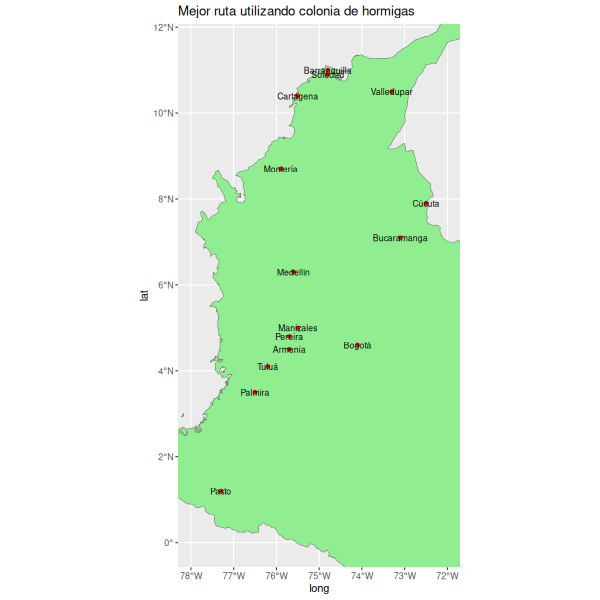
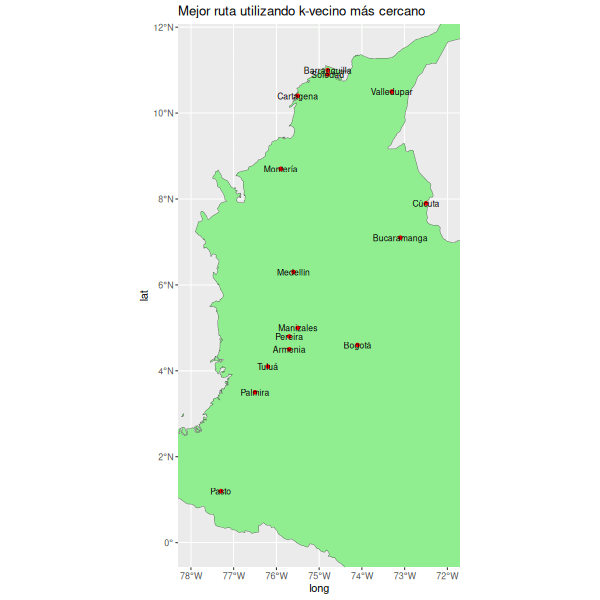

---
output:
  html_document:
    toc: false
    css: apa_style.css
    theme: united
    highlight: pygments
    df_print: paged
    number_sections: false
  pdf_document:
    toc: false
---

<!-- Portada del Trabajo -->

::: {style="text-align: center; color: black; margin-top: 60px;"}
<h1>TRABAJO 1: OPTIMIZACIÓN HEURÍSTICA</h1>

<h2>REDES NEURONALES Y ALGORITMOS BIOINSPIRADOS</h2>

<br><br><br>

<p><strong>Presentado por:</strong></p>

<p>Marcos David Carrillo Builes<br> Tomás Escobar Rivera Monsalve<br> Jose Fernando López Ramírez <br> Esteban Vásquez Pérez</p>

<br><br>

<p><strong>Profesor:</strong> Juan David Ospina Arango</p>

<p><strong>Monitor:</strong> Andrés Mauricio Zapata Rincón</p>

<br>  <br><br>

<p>Universidad Nacional de Colombia<br> Facultad de Minas<br> Ingeniería de Sistemas e Informática</p>

<p><strong>`r format(Sys.Date(), "%d de %B de %Y")`</strong></p>
:::

```{r setup, include=FALSE}
# --------------------------------------------------
# BLOQUE PRINCIPAL DE LIBRERÍAS (REEMPLAZA TODOS LOS LIBRARY() INDIVIDUALES)
# --------------------------------------------------
if (!require("pacman")) install.packages("pacman")
pacman::p_load(
  # Optimización numérica
  numDeriv,       # Gradientes/Hessianos
  GA,              # Algoritmos genéticos
  pso,             # Optimización por enjambre
  DEoptim,         # Evolución diferencial
  
  # Visualización
  ggplot2,         # Gráficos estáticos
  gganimate,       # Animaciones
  sf,              # Geodatos
  plotly,
  animation,
  
  # Datos
  dplyr,            # Manipulación de datos
  tidyverse
)

knitr::opts_chunk$set(echo = TRUE)
# --------------------------------------------------
```

#### Verificación de la carga de paquetes

```{r}
packages <- c(
  "numDeriv", "GA", "pso", "DEoptim",
  "ggplot2", "gganimate", "sf", "plotly", "dplyr","animation"
)

not_installed <- packages[!sapply(packages, require, character.only = TRUE)]

if (length(not_installed) == 0) {
  message("Paquetes instalados correctamente ")
} else {
  message("No se instalaron los paquetes: ", paste(not_installed, collapse = ", "))
}
```

# Parte 1: Optimización Numérica

-   Optimice las funciones en dos y tres dimensiones usando un método de descenso por gradiente con condición inicial aleatoria

-   Optimice las funciones en dos y tres dimensiones usando: algoritmos evolutivos, optimización de partículas y evolución diferencial

-   Represente con un gif animado o un video el proceso de optimización de descenso por gradiente y el proceso usando el método heurístico.

-   ¿Qué aportaron los métodos de descenso por gradiente y qué aportaron los métodos heurísticos? Para responder a esta pregunta considere el valor final de la función objetivo y el número de evaluaciones de la función objetivo. Para responder a esta pregunta es posible que se requiera hacer varias corridas de los algoritmos.


## 0. Exploración de las funciones

### Función de Schwefel

$$
f(\mathbf{x}) = 418.9829d - \sum_{i=1}^d x_i \sin(\sqrt{|x_i|})
$$


**Descripción:**

*Dimensiones:* $d$

La función de Schwefel cuenta con múltiples mínimos locales.

**Dominio:**

La función se evalúa en el hipercubo: $x_i \in [-500, 500]$, para todo $i = 1, \dots, d$.

**Mínimo Global:**

$f(\mathbf{x}^*) = 0$, en $\mathbf{x}^* = (420.9687, \dots, 420.9687)$

#### Definición de Función

```{r functions}
# Función Schwefel
schwefel <- function(x) {
  A <- 418.9829
  d <- length(x)
  z <- A*d - sum(x * sin(sqrt(abs(x))))
 
  return (z)
}
```

Sabemos que la función de Schwefel tiene un mínimo local en $x^*=(420.9687, \cdots, 420.9687)$

```{r}
schwefel(c(420.9687, 420.9687))
schwefel(c(420.9687, 420.9687, 420.9687))
```

Estos resultados representan valores aproximados a cero debido a errores de redondeo introducidos en la programación de la función.

Ahora vamos a visualizar la función:

```{r}
# Código para graficar cualquier función
plot_function <- function(func, x_range = c(-500, 500), n_points = 1000, highlight_x = NULL) {
  # Crear el vector de x en el rango especificado
  x <- seq(x_range[1], x_range[2], length.out = n_points)
 
  # Evaluar la función en los puntos de x
  y <- sapply(x, function(xi) func(c(xi)))
 
  # Graficar la función
  plot(x, y, type = "l", col = "blue", lwd = 2,
       main = paste("Gráfico de la función", deparse(substitute(func))),
       xlab = "x", ylab = paste(deparse(substitute(func)), "(x)"))
 
  # Si se especifica un valor de x para destacar, agregar la línea vertical y el punto
  if (!is.null(highlight_x)) {
    highlight_y <- func(c(highlight_x))
    abline(v = highlight_x, col = "red", lty = 2)
    points(highlight_x, highlight_y, col = "red", pch = 19)
  }
}
```

```{r fig.cap="**Fig 1.** _Evaluación de Schwefel (2D)_" , fig.align="center", out.width="70%"}
plot_function(schwefel, highlight_x = 420.9687)
```

```{r}
plot_function_3d <- function(func,
                           x_range = c(-500, 500),
                           y_range = c(-500, 500),
                           resolution = 100,
                           optimal_points = NULL,
                           colorscale = "Viridis",
                           title = "Visualización 3D de función",
                           x_label = "x",
                           y_label = "y",
                           z_label = "f(x,y)") {
 
  # Crear grid de puntos
  x <- seq(x_range[1], x_range[2], length.out = resolution)
  y <- seq(y_range[1], y_range[2], length.out = resolution)
 
  # Evaluar la función en toda la cuadrícula
  z <- outer(x, y, Vectorize(function(x, y) func(c(x, y))))
 
  # Crear el gráfico 3D interactivo
  p <- plot_ly(x = ~x, y = ~y, z = ~z) %>%
    add_surface(colorscale = colorscale)
 
  # Agregar puntos óptimos si se especifican
  if (!is.null(optimal_points)) {
    for (i in 1:nrow(optimal_points)) {
      point <- optimal_points[i, ]
      p <- p %>% add_markers(
        x = point$x,
        y = point$y,
        z = func(c(point$x, point$y)),
        marker = list(color = point$color, size = point$size),
        name = point$name
      )
    }
  }
 
  # Configurar el diseño del gráfico
  p <- p %>% layout(
    title = title,
    scene = list(
      xaxis = list(title = x_label),
      yaxis = list(title = y_label),
      zaxis = list(title = z_label)
    )
  )
 
  return(p)
}
```

```{r fig.cap="**Fig 2.** *Evaluación de Schwefel (3D)*", fig.align="center", out.width="70%", layout.align="center"}
# Definir óptimo schwefel
optimal_points <- data.frame(
  x = c(420.9687),
  y = c(420.9687),
  name = c("Óptimo global"),
  color = c("red"),
  size = c(5)
)

# Graficar la función con su óptimo
plot_function_3d(
  func = schwefel,
  x_range = c(-500, 500),
  y_range = c(-500, 500),
  resolution = 100,
  optimal_points = optimal_points,
  title = "Función de Schwefel (2D -> 3D)",
  z_label = "Schwefel(x, y)"
)
```

```{r fig.cap="**Fig 3.** _Curvas de Nivel de Schwefel_", fig.align="center", out.width="70%"}
# Crear una grilla de puntos (para 2D)
x_vals <- seq(-500, 500, length.out = 200)
y_vals <- seq(-500, 500, length.out = 200)
grid <- expand.grid(x = x_vals, y = y_vals) %>%
  rowwise() %>%
  mutate(z = schwefel(c(x, y))) %>%
  ungroup()

# Crear una grilla de puntos (para 2D)
x_vals <- seq(-500, 500, length.out = 200)
y_vals <- seq(-500, 500, length.out = 200)
grid <- expand.grid(x = x_vals, y = y_vals) %>%
  rowwise() %>%
  mutate(z = schwefel(c(x, y))) %>%
  ungroup()

# Obtener valores mínimo y máximo para crear breaks personalizados
z_min <- min(grid$z)
z_max <- max(grid$z)

# Crear el gráfico con la leyenda vertical pequeña a la derecha
ggplot(grid, aes(x = x, y = y, fill = z)) +
  geom_raster() +
  geom_contour(aes(z = z), color = "black", alpha = 0.3) +
  geom_point(aes(x = 420.9687, y = 420.9687), color = "red", size = 3) +
  annotate("text", x = 420.9687, y = 420.9687 + 30, label = "Óptimo", color = "red") +
  theme_minimal() +
  scale_fill_viridis_c(
    # Crear breaks que incluyan el cero y otros valores importantes
    breaks = c(z_min, 0, z_max/2, z_max),
    labels = function(x) round(x, 0)  # Redondear valores para mayor claridad
  ) +
  labs(
    title = "Mapa de calor + curvas de nivel - Schwefel",
    subtitle = "Visualización 2D continua",
    x = "Valor de x₁",
    y = "Valor de x₂",
    fill = "Valor de la función"
  ) +
  # Configurar la leyenda vertical pequeña a la derecha
  theme(
    legend.position = "right",
    legend.title.position = "top",
    # Hacer que la barra sea aproximadamente el 10% de la altura del gráfico
    legend.key.height = unit(0.1, "npc"),  # 10% de la altura del gráfico
    legend.key.width = unit(0.5, "cm"),    # Ancho reducido
    legend.margin = margin(0, 0, 0, 0),
    legend.box.margin = margin(0, 0, 0, 10)
  )
```


### Función de Griewank

$$
f(\mathbf{x}) = 1 + \frac{1}{4000} \sum_{i=1}^{d} x_i^2 - \prod_{i=1}^{d} \cos\left(\frac{x_i}{\sqrt{i}}\right)
$$

**Descripción:**

*Dimensiones:* $d$

La función de Griewank tiene una estructura ondulada con múltiples mínimos locales, pero un único mínimo global en el origen.

**Dominio:**

$x_i \in [-600, 600]$, para todo $i = 1, \dots, d$

**Mínimo Global:**

$f(\mathbf{0}) = 0$, en $\mathbf{x} = (0, \dots, 0)$

### Definición de Función

```{r function Griewank}
# Función Griewank (2D y 3D)
griewank <- function(x) {
  sum_term <- sum(x^2) / 4000
  prod_term <- prod(cos(x / sqrt(seq_along(x))))
  return(1 + sum_term - prod_term)
}
```

```{r}
griewank(c(0, 0))
griewank(c(0, 0, 0))
```

Estos resultados representan el mínimo global de la función de Griewank, que es 0 en el origen.

```{r fig.cap="**Fig 4.** *Evaluación de Griewank (2D)*", fig.align="center", out.width="70%"}
plot_function(griewank, x_range = c(-600, 600), highlight_x = 0)
```

```{r fig.cap="**Fig 5.** *Evaluación de Griewank (3D)*", fig.align="center", out.width="70%"}
# Definir óptimo griewank
optimal_points <- data.frame(
  x = c(0),
  y = c(0),
  name = c("Óptimo global"),
  color = c("red"),
  size = c(5)
)

# Graficar la función con su óptimo
plot_function_3d(
  func = griewank,
  x_range = c(-600, 600),
  y_range = c(-600, 600),
  resolution = 100,
  optimal_points = optimal_points,
  title = "Función de Griewank (2D -> 3D)",
  z_label = "Griewank(x, y)"
)
```

```{r fig.cap="**Fig 6.** _Curvas de Nivel de Griewank_", fig.align="center", out.width="70%"}
# Crear una grilla de puntos (para 2D)
x_vals <- seq(-600, 600, length.out = 200)
y_vals <- seq(-600, 600, length.out = 200)
grid <- expand.grid(x = x_vals, y = y_vals) %>%
  rowwise() %>%
  mutate(z = griewank(c(x, y))) %>%
  ungroup()

# Calcular valores importantes para los breaks
z_min <- min(grid$z)
z_max <- max(grid$z)

# Crear gráfico con visualización continua
ggplot(grid, aes(x = x, y = y, fill = z)) +
  geom_raster() +  # Usar raster para visualización continua
  geom_contour(aes(z = z), color = "black", alpha = 0.3) +  # Líneas de nivel
  geom_point(aes(x = 0, y = 0), color = "red", size = 3) +  # Óptimo
  annotate("text", x = 0, y = 30, label = "Óptimo", color = "red") +
  theme_minimal() +
  scale_fill_viridis_c(
    # Crear breaks que incluyan el cero y otros valores importantes
    breaks = c(z_min, 0, z_max/2, z_max),
    labels = function(x) round(x, 2)  # Redondear valores para mayor claridad
  ) +
  labs(
    title = "Mapa de calor + curvas de nivel - Griewank",
    subtitle = "Visualización 2D continua",
    x = "Valor de x₁",
    y = "Valor de x₂",
    fill = "Valor de la función"
  ) +
  # Configurar la leyenda vertical pequeña a la derecha
  theme(
    legend.position = "right",
    legend.title.position = "top",
    legend.key.height = unit(0.1, "npc"),  # 10% de la altura del gráfico
    legend.key.width = unit(0.5, "cm"),    # Ancho reducido
    legend.margin = margin(0, 0, 0, 0),
    legend.box.margin = margin(0, 0, 0, 10)
  )
```

## 1. Optimización por descenso del gradiente o métodos Quasi-Newton

Como podemos ver, las funciones cuentan con varios mínimos locales que pueden hacer que un método numérico basado en el gradiente sea propenso a errores. Para ello vamos a ver cómo se comporta la solución del método `optim(method = "BFGS")` que es el más parecido al que vimos en clase. Este método Quasi-Newton optimiza la función utilizando una aproximación del gradiente y la matriz Hessiana, sin calcularlos directamente.

Antes de esto vamos a crear vectores para seguir las soluciones halladas.

```{r}

# Vectores para almacenar los valores intermedios de la función - Schwefel
schwefel_2d_history <- list()

# Función para llenar el camino de valores 2D - Schwefel
schwefel_with_history_2d <- function(x) {
  val <- schwefel(x)
  schwefel_2d_history <<- c(schwefel_2d_history, list(list(x = x, value = val)))  # Guarda el valor intermedio
  return(val)
}

schwefel_3d_history <- list()

# Función para llenar el camino de valores 3D - Schwefel
schwefel_with_history_3d <- function(x) {
  val <- schwefel(x)
  schwefel_3d_history <<- c(schwefel_3d_history, list(list(x = x, value = val)))  # Guarda el valor intermedio
  return(val)
}
  
# Vectores para almacenar los valores intermedios de la función - Griewank
griewank_2d_history <- list()

# Función para llenar el camino de valores 2D - Schwefel
griewank_with_history_2d <- function(x) {
  val <- griewank(x)
  griewank_2d_history <<- c(griewank_2d_history, list(list(x = x, value = val)))  # Guarda el valor intermedio
  return(val)
}

griewank_3d_history <- list()

# Función para llenar el camino de valores 3D - Schwefel
griewank_with_history_3d <- function(x) {
  val <- griewank(x)
  griewank_3d_history <<- c(griewank_3d_history, list(list(x = x, value = val)))  # Guarda el valor intermedio
  return(val)
  
}
```

```{r}
# Optimización 2D

set.seed(1987)

x0_2d <- runif(1, min=-500, max=500)
x0_2d_g <- runif(1,min=-600,max=600)

# Optimización
res_2d <- optim(
  par = x0_2d,
  fn = schwefel_with_history_2d,
  method = "BFGS",
  control = list(trace = 1, REPORT = 1, maxit = 500),
  hessian = FALSE  # En 2d no usamos el Hessiano sino el gradiente únicamente
)

# Optimización Griewank
res_2d_g <- optim(
  par = x0_2d_g,
  fn = griewank_with_history_2d,
  method = "BFGS",
  control = list(trace = 1, REPORT = 1, maxit = 500),
  hessian = FALSE  # En 2d no usamos el Hessiano sino el gradiente únicamente
)
```


```{r echo=FALSE}
# Óptimos teóricos
optimo_schwefel_2d <- "f(420.9687, 420.9687) ≈ 0"
optimo_griewank_2d <- "f(0, 0) = 0"

# Tus resultados
mi_optimo_schwefel <- paste0("(", 
                             round(res_2d$par[1], 4),
                             ") con valor ", round(res_2d$value, 4))

mi_optimo_griewank <- paste0("(", 
                             round(res_2d_g$par[1], 4),
                             ") con valor ", round(res_2d_g$value, 4))

# Crear tabla con data.frame
tabla_2d <- data.frame(
  Función = c("Schwefel", "Griewank"),
  Óptimo_Global = c(optimo_schwefel_2d, optimo_griewank_2d),
  Óptimo_Obtenido = c(mi_optimo_schwefel, mi_optimo_griewank),
  stringsAsFactors = FALSE
)

# Mostrar tabla con formato kableExtra
knitr::kable(tabla_2d, digits = 4, 
             caption = paste("Tabla 1: Comparación de Óptimos en 2D"),
             format = "html") %>%
  kableExtra::kable_styling(bootstrap_options = c("striped", "hover"),
                            full_width = FALSE) %>%
  kableExtra::column_spec(1:ncol(tabla_2d), width = "2cm") %>%
  kableExtra::row_spec(0, bold = TRUE, color = "black", background = "lightgray")
```

```{r}
# Optimización 3D

set.seed(1987)

x0_3d <- runif(2, min=-500, max=500)
x0_3d_g <- runif(2, min=-600, max=600)


# Optimización
res_3d <- optim(
  par = x0_3d,
  fn = schwefel_with_history_3d,
  method = "BFGS",
  control = list(trace = 1, REPORT = 1, maxit = 1000),
)

res_3d_g <- optim(
  par = x0_3d_g,
  fn = griewank_with_history_3d,
  method = "BFGS",
  control = list(trace = 1, REPORT = 1, maxit = 1000),
)
```

```{r echo=FALSE}
# Óptimos teóricos para 3D
optimo_schwefel_3d <- "f(420.9687, 420.9687) ≈ 0"
optimo_griewank_3d <- "f(0, 0) = 0"

# Tus resultados para 3D
mi_optimo_schwefel_3d <- paste0("(", 
                                round(res_3d$par[1], 4), ", ",
                                round(res_3d$par[2], 4),
                                ") con valor ", round(res_3d$value, 4))

mi_optimo_griewank_3d <- paste0("(", 
                                round(res_3d_g$par[1], 4), ", ",
                                round(res_3d_g$par[2], 4),
                                ") con valor ", round(res_3d_g$value, 4))

# Crear tabla con data.frame
tabla_3d <- data.frame(
  Función = c("Schwefel", "Griewank"),
  Óptimo_Global = c(optimo_schwefel_3d, optimo_griewank_3d),
  Óptimo_Obtenido = c(mi_optimo_schwefel_3d, mi_optimo_griewank_3d),
  stringsAsFactors = FALSE
)

# Mostrar tabla con formato kableExtra
knitr::kable(tabla_3d, digits = 4, 
             caption = paste("Tabla 2: Comparación de Óptimos en 3D"),
             format = "html") %>%
  kableExtra::kable_styling(bootstrap_options = c("striped", "hover"),
                            full_width = FALSE) %>%
  kableExtra::column_spec(1:ncol(tabla_3d), width = "2cm") %>%
  kableExtra::row_spec(0, bold = TRUE, color = "black", background = "lightgray")
```

Más adelante vamos a visualizar estos métodos para tener una mejor forma de interpretar los resultados obtenidos. Además vamos a **explicar por qué no se llega al óptimo global**.


### 2. Métodos Heurísticos

Nos enfocaremos en tres poderosos métodos heurísticos inspirados en la naturaleza:

Algoritmos Evolutivos (GA), que emulan el proceso de selección natural para encontrar soluciones óptimas.

Optimización por Enjambre de Partículas (PSO), basada en el comportamiento colectivo de animales como aves o peces.

Estrategias de Evolución Diferencial (DE), un método robusto de optimización global que combina mutación, cruce y selección.

#### 2.1 Algoritmo Genético (GA)

```{r Algoritmo Genético}
# Función que aplica un Algoritmo Genético (GA) para optimizar una función de prueba
# y guarda el historial de las mejores soluciones en cada iteración.

genetic_optimizer_with_history <- function(func, lower, upper, dim, popSize, maxiter) {
  # Lista para almacenar el historial de la mejor solución en cada iteración
  history <- list()

  # Función monitor que se ejecuta en cada iteración del GA
  # Guarda el mejor individuo de la población y su evaluación con la función objetivo
  monitor <- function(obj) {
    # Extraer el mejor individuo de la población actual (mayor fitness)
    best <- obj@population[which.max(obj@fitness), ]
    
    # Evaluar la función objetivo con ese individuo
    val <- func(best)
    
    # Guardar la solución y su valor en el historial, indexado por el número de iteración
    history[[obj@iter]] <<- list(x = best, value = val)
  }

  # Ejecutar el Algoritmo Genético
  result <- ga(
    type = "real-valued",                     
    fitness = function(x) -func(x),           
    lower = rep(lower, dim),                  
    upper = rep(upper, dim),                  
    popSize = popSize,                        
    maxiter = maxiter,                        
    monitor = monitor                         
  )

  return(list(result = result, history = history))
}
```

Creamos una tabla para ver los resultados con varios valores posibles y comparar las soluciones para así elegir los mejores parámetros. De una vez la generalizamos para los otros métodos.

```{r tabla_ga}
optimizer_test <- function(method, func, func_name, dim, lower, upper) {
  # Definir parámetros por método
  params_list <- switch(method,
    "GA" = list(
      popSize = c(30, 50, 100),
      maxiter = c(50, 100, 200)
    ),
    "PSO" = list(
      s = c(20, 40, 60),
      maxit = c(50, 100, 200)
    ),
    "DE" = list(
      NP = c(30, 50, 70),
      itermax = c(50, 100, 200)
    )
  )
  
  # Crear combinaciones de parámetros
  param_combinations <- expand.grid(params_list)
  
  # Función para ejecutar cada combinación
  run_combination <- function(params) {
    start_time <- Sys.time()
    
    result <- switch(method,
      "GA" = genetic_optimizer_with_history(
        func = func,
        lower = lower,
        upper = upper,
        dim = dim,
        popSize = params[[1]],
        maxiter = params[[2]]
      ),
      "PSO" = pso_optimizer_with_history(
        func = func,
        lower = lower,
        upper = upper,
        dim = dim,
        maxit = params[[2]],
        s = params[[1]]
      ),
      "DE" = de_optimizer_with_history(
        func = func,
        lower = lower,
        upper = upper,
        dim = dim,
        NP = params[[1]],
        itermax = params[[2]]
      )
    )
    
    # Extraer resultados comunes
    best_value <- switch(method,
      "GA" = -result$result@fitnessValue,
      "PSO" = result$result$value,
      "DE" = result$result$optim$bestval
    )
    
    convergence_iter <- switch(method,
      "GA" = result$result@iter,
      "PSO" = which.min(sapply(result$history, function(x) x$value)),
      "DE" = result$result$optim$iter
    )
    
    elapsed <- as.numeric(Sys.time() - start_time)
    
    # Nombre de parámetros específicos por método
    param_names <- switch(method,
      "GA" = c("Población", "Iteraciones"),
      "PSO" = c("Enjambre", "Iteraciones"),
      "DE" = c("Población", "Iteraciones")
    )
    
    return(c(
      best_value = best_value,
      convergence_iter = convergence_iter,
      param1 = params[[1]],
      param2 = params[[2]],
      time = elapsed
    ))
  }
  
  # Ejecutar todas las combinaciones
  results <- apply(param_combinations, 1, run_combination)
  
  # Convertir a data.frame
  results_df <- as.data.frame(t(results))
  
  # Nombrar columnas según método
  colnames(results_df) <- c("Mejor Valor", "Iter Convergencia",
                           switch(method,
                             "GA" = c("Tamaño Población", "Máx Iteraciones"),
                             "PSO" = c("Tamaño Enjambre", "Máx Iteraciones"),
                             "DE" = c("Tamaño Población", "Máx Iteraciones")
                           ),
                           "Tiempo (s)")
  
  # Ordenar por mejor valor
  results_df <- results_df[order(results_df$"Mejor Valor"), ]
  
  # Numeración dinámica para el caption de la tabla
  table_num <- switch(method,
    "GA" = switch(func_name,
      "Schwefel" = ifelse(dim == 2, 3, 4),
      "Griewank" = ifelse(dim == 2, 5, 6)
    ),
    "PSO" = switch(func_name,
      "Schwefel" = ifelse(dim == 2, 7, 8),
      "Griewank" = ifelse(dim == 2, 9, 10)
    ),
    "DE" = switch(func_name,
      "Schwefel" = ifelse(dim == 2, 11, 12),
      "Griewank" = ifelse(dim == 2, 13, 14)
    )
  )
  
  # Mostrar tabla 
  knitr::kable(results_df, digits = 4, 
              caption = paste("Tabla", table_num, ". Resultados de", method, "para", func_name, dim, "D"),
               format = "html") %>%
    kableExtra::kable_styling(bootstrap_options = c("striped", "hover"),
                              full_width = FALSE) %>%
    kableExtra::column_spec(1:ncol(results_df), width = "2cm") %>%
    kableExtra::row_spec(0, bold = TRUE, color = "black", background = "lightgray")

}
```

##### Schwefel 2D
```{r}
optimizer_test("GA", schwefel, "Schwefel", 2, -500, 500)
```

Elegimos el mejor resultado que obtenemos y llamamos a la función para guardar su historial y poder graficarlo después.

```{r ga_schwefel 2D}
ga_schwefel_2d <- genetic_optimizer_with_history(schwefel, -500, 500, dim = 2, popSize = 30, maxiter = 200)
```

##### Schwefel 3D
```{r}
optimizer_test("GA", schwefel, "Schwefel", 3, -500, 500)
```

```{r ga_schwefel 3D}
ga_schwefel_3d <- genetic_optimizer_with_history(schwefel, -500, 500, dim = 3, popSize = 30, maxiter = 200)
```

##### Griewank 2D
```{r}
optimizer_test("GA", griewank, "Griewank", 2, -500, 500)
```

```{r ga_griewank 2D}
ga_griewank_2d <- genetic_optimizer_with_history(griewank, -600, 600, dim = 2, popSize = 100, maxiter = 100)
```

##### Griewank 3D
```{r}
optimizer_test("GA", griewank, "Griewank", 3, -500, 500)
```

```{r ga_griewank 3D}
ga_griewank_3d <- genetic_optimizer_with_history(griewank, -600, 600, dim = 3, popSize = 100, maxiter = 100)
```

#### 2.2 Optimización por Enjambre (PSO)

```{r Optimización por Enjambre}
# Función que aplica el algoritmo de Optimización por Enjambre de Partículas (PSO)
# para minimizar una función objetivo y guarda el historial de puntos evaluados.

pso_optimizer_with_history <- function(func, lower, upper, dim, maxit, s) {
  # Lista para guardar el historial de evaluaciones
  history <- list()

  # Se define una función "envoltura" que intercepta las evaluaciones de la función objetivo
  # y guarda cada punto (posición del enjambre) con su valor correspondiente.
  wrapped_func <- function(x) {
    val <- func(x)  # Evaluar la función en x
    history[[length(history) + 1]] <<- list(x = x, value = val)  # Guardar evaluación
    return(val)  # Devolver el valor calculado (PSO minimiza este valor)
  }

  # Ejecutar el algoritmo de PSO:
  result <- psoptim(
    par = runif(dim, lower, upper),         
    fn = wrapped_func,                      
    lower = rep(lower, dim),                
    upper = rep(upper, dim),                
    control = list(maxit = maxit, s = s)    
  )

  return(list(result = result, history = history))
}
```

##### Schwefel 2D
```{r}
optimizer_test("PSO", schwefel, "Schwefel", 2, -500, 500)
```

```{r pso_schwefel 2D}
pso_schwefel_2d <- pso_optimizer_with_history(schwefel, -500, 500, dim = 3, maxit = 200, s = 20)
```

##### Schwefel 3D
```{r}
optimizer_test("PSO", schwefel, "Schwefel", 3, -500, 500)
```

```{r pso_schwefel 3D}
pso_schwefel_3d <- pso_optimizer_with_history(schwefel, -500, 500, dim = 3, maxit = 200, s = 40)
```

##### Griewank 2D
```{r}
optimizer_test("PSO", griewank, "Griewank", 2, -600, 600)
```

```{r pso_griewank 2D}
pso_griewank_2d <- pso_optimizer_with_history(griewank, -600, 600, dim = 2, maxit = 200, s = 40)
```

##### Griewank 3D
```{r}
optimizer_test("PSO", griewank, "Griewank", 3, -600, 600)
```

```{r pso_griewank 3D}
pso_griewank_3d <- pso_optimizer_with_history(griewank, -600, 600, dim = 2, maxit = 200, s = 60)
```

#### 2.3 Evolución Diferencial (DE)

```{r Evolución Diferencial}
# Función que aplica el algoritmo de Evolución Diferencial (DE)
# para minimizar una función objetivo y guarda el historial de soluciones.

de_optimizer_with_history <- function(func, lower, upper, dim, NP = 50, itermax = 100) {
  # Crea vectores de límites inferiores y superiores replicados por cada dimensión
  lower_vec <- rep(lower, dim)
  upper_vec <- rep(upper, dim)

  # Ejecuta el algoritmo DE usando la función DEoptim
  result <- DEoptim(
    fn = func,                    
    lower = lower_vec,            
    upper = upper_vec,            
    control = DEoptim.control(
      NP = NP,                    
      itermax = itermax,         
      storepopfrom = 1,          
      trace = FALSE              
    )
  )

  # Extraer el historial de las mejores soluciones por iteración desde result$member$bestmemit
  pops <- result$member$bestmemit  # Matriz con la mejor solución por iteración (columnas = pasos)
  history <- vector("list", ncol(pops))  # Inicializar lista de historial

  # Recorrer las columnas (iteraciones) y guardar cada punto con su evaluación
  for (i in seq_len(ncol(pops))) {
    x <- pops[, i]             # Solución en la iteración i
    val <- func(x)             # Evaluar función en ese punto
    history[[i]] <- list(x = x, value = val)  # Guardar en historial
  }

  return(list(result = result, history = history))
}
```

##### Schwefel 2D
```{r}
optimizer_test("DE", schwefel, "Schwefel", 2, -500, 500)
```

```{r de_schwefel_2D}
de_schwefel_2d <- de_optimizer_with_history(schwefel, -500, 500, dim = 2, NP = 30, itermax = 200)
```

##### Schwefel 3D
```{r}
optimizer_test("DE", schwefel, "Schwefel", 3, -500, 500)
```

```{r de_schwefel 3D}
de_schwefel_3d <- de_optimizer_with_history(schwefel, -500, 500, dim = 3, NP = 30, itermax = 200)
```

##### Griewank 2D
```{r}
optimizer_test("DE", griewank, "Griewank", 2, -600, 600)
```

```{r de_griewank 2D}
de_griewank_2d <- de_optimizer_with_history(griewank, -600, 600, dim = 2, NP = 70, itermax = 200)
```

##### Griewank 3D
```{r}
optimizer_test("DE", griewank, "Griewank", 3, -600, 600)
```

```{r de_griewank 3D}
de_griewank_3d <- de_optimizer_with_history(griewank, -600, 600, dim = 3, NP = 30, itermax = 200)
```

Nótese que a diferencia de los métodos clásicos como el descenso del gradiente, cada uno de los métodos heurísticos logra llegar al valor óptimo de 0. 

Además, se puede observar que los resultados de Evolución Diferencial tienden a ser más eficientes y llegan a los óptimos en pocas iteraciones. Más adelante entraremos en detalle para comparar a estos algoritmos evolutivos.


## 3. Visualización de Resultados

### 3.1 Animación del Descenso de Gradiente

Para crear la animación debemos generar múltiples imágenes usando el historial de soluciones evaluadas en la función objetivo.

#### Schwefel

```{r}
# Base de la curva de la función schwefel
x_vals <- seq(-500, 500, length.out = 1000)
curve_df_2d <- data.frame(x = x_vals, value = sapply(x_vals, function(xi) schwefel(c(xi))))

# Extraer historia del optimizador
schwefel_df_2d <- data.frame(
  step = 1:length(schwefel_2d_history),
  x = sapply(schwefel_2d_history, function(p) p$x),
  value = sapply(schwefel_2d_history, function(p) p$value)
)
```

**Camino de la solución en Schwefel 2D**

```{r eval=FALSE}
p <- ggplot() +
  geom_line(data = curve_df_2d, aes(x = x, y = value), color = "blue", linewidth = 1.2) +
  geom_point(data = schwefel_df_2d, aes(x = x, y = value), color = "red", size = 2) +
  transition_reveal(along = step) +
  labs(title = "Paso del optimizador: {frame_along}", x = "x", y = "Schwefel(x)") +
  theme_minimal()

animate(p, fps = 4, width = 600, height = 400, renderer = gifski_renderer("files/schwefel_path.gif"))
```

```{r fig.cap="**Fig 7.** *Camino de la solución en Schwefel 2D*", fig.align="center", out.width="70%"}
knitr::include_graphics("files/schwefel_path.gif")
```

Como podemos notar, los algoritmos numéricos dependen altamente de la elección del punto inicial $x_0^*$. En el GIF se ve además que la solución se desplaza por fuera de la gráfica, esto se debe a que el optimizador podría estar explorando soluciones que se mueven en $c(x1)$, pero al graficar los frames se pueden ver puntos intermedios en la solución. Sin embargo finalmente se vuelve a la gráfica cuando se está estabilizando el óptimo.

**Camino de la solución en Schwefel 3D con curvas de nivel**

```{r}
x_vals <- seq(-500, 500, length.out = 200)
y_vals <- seq(-500, 500, length.out = 200)
grid <- expand.grid(x = x_vals, y = y_vals) %>%
  rowwise() %>%
  mutate(z = schwefel(c(x, y))) %>%
  ungroup()

schwefel_df_3d <- data.frame(
  step = 1:length(schwefel_3d_history),
  x = sapply(schwefel_3d_history, function(p) p$x[1]),
  y = sapply(schwefel_3d_history, function(p) p$x[2]),
  z = sapply(schwefel_3d_history, function(p) p$value)
)
```

```{r eval=FALSE}
p <- ggplot() +
  # Capa BASE de relleno
  geom_raster(data = grid, aes(x = x, y = y, fill = z), alpha = 0.5) +
  scale_fill_viridis_c(option = "viridis", name = "Valor Schwefel") +
  
  # Curvas de nivel
  geom_contour(data = grid, aes(x = x, y = y, z = z), 
               color = "black", alpha = 0.4, bins = 15) +
  
  # Trayectoria del optimizador
  geom_path(data = schwefel_df_3d, aes(x = x, y = y), 
            color = "darkgrey", alpha = 0.5, linewidth = 0.8) +
  
  # Puntos animados (nuevo esquema de colores)
  geom_point(data = schwefel_df_3d, aes(x = x, y = y, color = step), 
             size = 3, show.legend = FALSE) +
  scale_color_gradient(low = "orange", high = "red") +  # Azul a verde
  
  # Punto óptimo
  geom_point(aes(x = 420.9687, y = 420.9687), 
             shape = 17, color = "cyan", size = 4) +
  annotate("text", x = 420.9687, y = 450, label = "Óptimo Global", 
           color = "cyan", fontface = "bold") +
  
  # Estilo y animación
  theme_minimal() +
  labs(
    title = "Optimización de la Función Schwefel\nPaso: {frame_time}",
    x = "Coordenada x₁",
    y = "Coordenada x₂"
  ) +
  transition_time(step) +
  shadow_wake(wake_length = 0.1, alpha = 0.3) +
  theme(plot.margin = margin(t = 30, r = 10, b = 10, l = 10, unit = "pt"))

# Renderizar la animación
animate(p, fps = 7, width = 800, height = 600, renderer = gifski_renderer("files/schwefel_3d_path.gif"))
```

```{r fig.cap="**Fig 8.** *Camino de la solución en Schwefel 3D*", fig.align="center", out.width="70%"}
knitr::include_graphics("files/schwefel_3d_path.gif")
```

#### Griewank


```{r}
# Base de la curva de la función Griewank
x_vals <- seq(-600, 600, length.out = 1000)
curve_df_2d_g <- data.frame(x = x_vals, value = sapply(x_vals, function(xi) griewank(c(xi))))

# Extraer historia del optimizador
griewank_df_2d <- data.frame(
  step = 1:length(griewank_2d_history),
  x = sapply(griewank_2d_history, function(p) p$x),
  value = sapply(griewank_2d_history, function(p) p$value)
)
```

**Camino de la solución en Griewank 2D**

```{r eval=FALSE}
p <- ggplot() +
  geom_line(data = curve_df_2d_g, aes(x = x, y = value), color = "blue", linewidth = 1.2) +
  geom_point(data = griewank_df_2d, aes(x = x, y = value), color = "red", size = 2) +
  transition_reveal(along = step) +
  labs(title = "Paso del optimizador: {frame_along}", x = "x", y = "Griewank(x)") +
  theme_minimal()

animate(p, fps = 4, width = 600, height = 400, renderer = gifski_renderer("files/griewank_path.gif"))
```

```{r fig.cap="**Fig 9.** *Camino de la solución en Griewank 2D*", fig.align="center", out.width="70%"}
knitr::include_graphics("files/griewank_path.gif")
```

**Camino de la solución en Griewank 3D con curvas de nivel**

```{r}

x_vals <- seq(-600, 600, length.out = 200)
y_vals <- seq(-600, 600, length.out = 200)
grid <- expand.grid(x = x_vals, y = y_vals) %>%
  rowwise() %>%
  mutate(z = griewank(c(x, y))) %>%
  ungroup()

griewank_df_3d <- data.frame(
  step = 1:length(griewank_3d_history),
  x = sapply(griewank_3d_history, function(p) p$x[1]),
  y = sapply(griewank_3d_history, function(p) p$x[2]),
  z = sapply(griewank_3d_history, function(p) p$value)
  )
```

```{r eval=FALSE}
p <- ggplot() +
  # Capa BASE de relleno
  geom_raster(data = grid, aes(x = x, y = y, fill = z), alpha = 0.5) +
  scale_fill_viridis_c(option = "viridis", name = "Valor Griewank") +
  
  # Curvas de nivel
  geom_contour(data = grid, aes(x = x, y = y, z = z), 
               color = "black", alpha = 0.4, bins = 15) +
  
  # Trayectoria del optimizador
  geom_path(data = griewank_df_3d, aes(x = x, y = y), 
            color = "darkgrey", alpha = 0.5, linewidth = 0.8) +
  
  # Puntos animados (nuevo esquema de colores)
  geom_point(data = griewank_df_3d, aes(x = x, y = y, color = step), 
             size = 3, show.legend = FALSE) +
  scale_color_gradient(low = "orange", high = "red") +  # Azul a verde
  
  # Punto óptimo
  geom_point(aes(x = 0, y = 0), 
             shape = 17, color = "cyan", size = 4) +
  annotate("text", x = 0, y = 450, label = "Óptimo Global", 
           color = "cyan", fontface = "bold") +
  
  # Estilo y animación
  theme_minimal() +
  labs(
    title = "Optimización de la Función Griewank\nPaso: {frame_time}",
    x = "Coordenada x₁",
    y = "Coordenada x₂"
  ) +
  transition_time(step) +
  shadow_wake(wake_length = 0.1, alpha = 0.3) +
  theme(plot.margin = margin(t = 30, r = 10, b = 10, l = 10, unit = "pt"))

# Renderizar la animación
animate(p, fps = 7, width = 800, height = 600, renderer = gifski_renderer("files/griewank_3d_path.gif"))
```

```{r fig.cap="**Fig 10.** *Camino de la solución en Griewank 3D*", fig.align="center", out.width="70%"}
knitr::include_graphics("files/griewank_3d_path.gif")
```

### 3.2 Animación de Métodos Heurísticos

```{r animación métodos heurísticos}
# Convertir historial en data.frame
convert_history_to_df <- function(history) {
  df <- data.frame(
    step = seq_along(history),
    x = sapply(history, function(p) p$x[1]),
    y = sapply(history, function(p) p$x[2]),
    value = sapply(history, function(p) p$value)
  )
  return(df)
}

# Base para curvas de nivel
create_grid <- function(func, lower, upper, n = 200) {
  x_vals <- seq(lower, upper, length.out = n)
  y_vals <- seq(lower, upper, length.out = n)
  grid <- expand.grid(x = x_vals, y = y_vals)
  grid$z <- apply(grid, 1, function(row) func(c(row[1], row[2])))
  return(grid)
}

# Crear y guardar animación
plot_trajectory_animation <- function(history_df, grid_df, func, title, output_file) {
  # Determinar punto óptimo según la función
  opt_point <- if (identical(func, schwefel)) {
    c(420.9687, 420.9687)
  } else if (identical(func, griewank)) {
    c(0, 0)
  } else {
    c(NA_real_, NA_real_)
  }

  # Posición del texto
  optimal_label_y <- ifelse(!is.na(opt_point[2]) && opt_point[2] > 0,
                            opt_point[2] + 30,
                            opt_point[2] + 3)

  # Crear el gráfico
  p <- ggplot() +
    geom_raster(data = grid_df, aes(x = x, y = y, fill = z), alpha = 0.5) +
    scale_fill_viridis_c() +
    geom_contour(data = grid_df, aes(x = x, y = y, z = z), color = "black", alpha = 0.4) +
    geom_path(data = history_df, aes(x = x, y = y), color = "darkgrey", alpha = 0.5) +
    geom_point(data = history_df, aes(x = x, y = y, color = step), size = 3, show.legend = FALSE) +
    scale_color_gradient(low = "orange", high = "red") +
    theme_minimal() +
    labs(
    title = paste0("Optimización de la Función ", title, "\nPaso: {frame_time}"),
      x = "x", 
      y = "y"
    ) +
    theme(plot.margin = margin(t = 40, r = 10, b = 10, l = 10, unit = "pt")) +
    transition_time(step) +
    shadow_wake(wake_length = 0.1, alpha = 0.3)

  # Añadir punto óptimo si es válido
  if (!any(is.na(opt_point))) {
    p <- p +
      geom_point(aes(x = opt_point[1], y = opt_point[2]), shape = 17, color = "cyan", size = 4) +
      annotate("text", x = opt_point[1], y = optimal_label_y, label = "Óptimo Global", 
               color = "cyan", fontface = "bold")
  }

  # Animar
  animate(p, fps = 6, width = 700, height = 500, renderer = gifski_renderer(output_file))
}
```

```{r, eval=FALSE}
# GA Schwefel 2D
history_df <- convert_history_to_df(ga_schwefel_2d$history)
grid_df <- create_grid(schwefel, -600, 600)
plot_trajectory_animation(history_df, grid_df, schwefel, "GA schwefel 2D", "files/ga_schwefel_2d.gif")
```

```{r fig.cap="**Fig 11.** *GA Schwefel 2D*", fig.align="center", out.width="70%"}
knitr::include_graphics("files/ga_schwefel_2d.gif")
```

```{r, eval=FALSE}
# GA Schwefel 3D
history_df <- convert_history_to_df(ga_schwefel_3d$history)
grid_df <- create_grid(schwefel, -600, 600)
plot_trajectory_animation(history_df, grid_df, schwefel, "GA schwefel 3D", "files/ga_schwefel_3d.gif")
```

```{r fig.cap="**Fig 12.** *GA Schwefel 3D*", fig.align="center", out.width="70%"}
knitr::include_graphics("files/ga_schwefel_3d.gif")
```


```{r, eval=FALSE}
# GA Griewank 2D
history_df <- convert_history_to_df(ga_griewank_2d$history)
grid_df <- create_grid(griewank, -600, 600)
plot_trajectory_animation(history_df, grid_df, griewank, "GA Griewank 2D", "files/ga_griewank_2d.gif")
```

```{r fig.cap="**Fig 13.** *GA Griewank 2D*", fig.align="center", out.width="70%"}
knitr::include_graphics("files/ga_griewank_2d.gif")
```

```{r, eval=FALSE}
# GA Griewank 3D
history_df <- convert_history_to_df(ga_griewank_3d$history)
grid_df <- create_grid(griewank, -600, 600)
plot_trajectory_animation(history_df, grid_df, griewank, "GA Griewank 3D", "files/ga_griewank_3d.gif")
```

```{r fig.cap="**Fig 14.** *GA Griewank 3D*", fig.align="center", out.width="70%"}
knitr::include_graphics("files/ga_griewank_3d.gif")
```

```{r, eval=FALSE}
# PSO Schwefel 2D
history_df <- convert_history_to_df(pso_schwefel_2d$history)
grid_df <- create_grid(schwefel, -600, 600)
plot_trajectory_animation(history_df, grid_df, schwefel, "GPSO schwefel 2D", "files/pso_schwefel_2d.gif")
```

```{r fig.cap="**Fig 15.** *PSO Schwefel 2D*", fig.align="center", out.width="70%"}
knitr::include_graphics("files/pso_schwefel_2d.gif")
```

```{r, eval=FALSE}
# PSO Schwefel 3D
history_df <- convert_history_to_df(pso_schwefel_3d$history)
grid_df <- create_grid(schwefel, -600, 600)
plot_trajectory_animation(history_df, grid_df, schwefel, "GPSO schwefel 3D", "files/pso_schwefel_3d.gif")
```

```{r fig.cap="**Fig 16.** *PSO Schwefel 3D*", fig.align="center", out.width="70%"}
knitr::include_graphics("files/pso_schwefel_3d.gif")
```

```{r, eval=FALSE}
# PSO Griewank 2D
history_df <- convert_history_to_df(pso_griewank_2d$history)
grid_df <- create_grid(griewank, -600, 600)
plot_trajectory_animation(history_df, grid_df, griewank, "PSO Griewank 2D", "files/pso_griewank_2d.gif")
```

```{r fig.cap="**Fig 17.** *PSO Griewank 2D*", fig.align="center", out.width="70%"}
knitr::include_graphics("files/pso_griewank_2d.gif")
```

```{r, eval=FALSE}
# PSO Griewank 3D
history_df <- convert_history_to_df(pso_griewank_3d$history)
grid_df <- create_grid(griewank, -600, 600)
plot_trajectory_animation(history_df, grid_df, griewank, "PSO Griewank 3D", "files/pso_griewank_3d.gif")
```

```{r fig.cap="**Fig 18.** *PSO Griewank 3D*", fig.align="center", out.width="70%"}
knitr::include_graphics("files/pso_griewank_3d.gif")
```

```{r, eval=FALSE}
# DE Schwefel 2D
history_df <- convert_history_to_df(de_schwefel_2d$history)
grid_df <- create_grid(schwefel, -500, 500)
plot_trajectory_animation(history_df, grid_df, schwefel, "DE Schwefel 2D", "files/de_schwefel_2d.gif")
```

```{r fig.cap="**Fig 19.** *DE Schwefel 2D*", fig.align="center", out.width="70%"}
knitr::include_graphics("files/de_schwefel_2d.gif")
```

```{r, eval=FALSE}
# DE Schwefel 3D
history_df <- convert_history_to_df(de_schwefel_3d$history)
grid_df <- create_grid(schwefel, -500, 500)
plot_trajectory_animation(history_df, grid_df, schwefel, "DE Schwefel 3D", "files/de_schwefel_3d.gif")
```

```{r fig.cap="**Fig 20.** *DE Schwefel 3D*", fig.align="center", out.width="70%"}
knitr::include_graphics("files/de_schwefel_3d.gif")
```

```{r, eval=FALSE}
# DE Griewank 2D
history_df <- convert_history_to_df(de_griewank_2d$history)
grid_df <- create_grid(griewank, -600, 600)
plot_trajectory_animation(history_df, grid_df, griewank, "DE Griewank 2D", "files/de_griewank_2d.gif")
```

```{r fig.cap="**Fig 21.** *DE Griewank 2D*", fig.align="center", out.width="70%"}
knitr::include_graphics("files/de_griewank_2d.gif")
```

```{r, eval=FALSE}
# DE Griewank 3D
history_df <- convert_history_to_df(de_griewank_3d$history)
grid_df <- create_grid(griewank, -600, 600)
plot_trajectory_animation(history_df, grid_df, griewank, "DE Griewank 3D", "files/de_griewank_3d.gif")
```

```{r fig.cap="**Fig 22.** *DE Griewank 3D*", fig.align="center", out.width="70%"}
knitr::include_graphics("files/de_griewank_3d.gif")
```

## 4. Conclusiones

### 4.1. Métodos Clásicos (Descenso del Gradiente)

Los métodos clásicos presentan limitaciones importantes en escenarios complejos. Para funciones con múltiples mínimos locales o derivadas de difícil cálculo, como Schwefel y Griewank, el descenso del gradiente tiende a quedarse atrapado en óptimos locales que pueden estar lejos del global. En nuestras funciones de prueba, observamos que para Schwefel las soluciones halladas estaban muy alejadas del óptimo, mientras que en Griewank, aunque los resultados fueron algo mejores debido a su forma semi-cuadrática, el método también se asentó en mínimos no globales. Por este motivo, en optimización de funciones no convexas se suele preferir el uso de métodos heurísticos, los cuales analizamos a continuación.

En las visualizaciones (Figuras 7, 8, 9 y 10) se aprecia que, en Schwefel, el optimizador se mueve inicialmente pero pronto queda atrapado en un óptimo local. En Griewank, el punto apenas se desplaza desde su solución inicial debido a la naturaleza ondulada del paisaje de la función.

*Nota: Aunque es posible encontrar mejores resultados seleccionando cuidadosamente la semilla inicial, un optimizador robusto no debería depender de esta elección.*

### 4.2. Métodos Heurísticos

#### 4.2.1. Algoritmos Genéticos

En las Tablas 3, 4, 5 y 6 se presentan los resultados para la optimización de Schwefel y Griewank en 2D y 3D. Estos resultados muestran que los algoritmos genéticos logran alcanzar valores cercanos o iguales al mínimo esperado. Aunque en algunas animaciones el movimiento hacia el óptimo no se muestra completamente, los resultados numéricos evidencian el éxito del algoritmo. Esta discrepancia puede deberse a limitaciones en la resolución de los gráficos, la construcción de los frames o a la dinámica propia del algoritmo.

En las Figuras 11, 12, 13 y 14 se observa que, con poblaciones de 30 y 100 individuos, los algoritmos genéticos obtienen soluciones consistentes en tiempos de ejecución razonables.

#### 4.2.2. Optimización por Enjambre de Partículas (PSO)

En la optimización mediante PSO se utilizaron tamaños de enjambre entre 20 y 60 partículas y máximos de 50 a 200 iteraciones, buscando balancear el tiempo de cómputo con la calidad de las soluciones.

Se observó que, en funciones como Schwefel, PSO puede requerir miles de iteraciones para llegar al óptimo global debido a la complejidad del paisaje de la función. Así, en algunos casos, las trayectorias de las partículas no alcanzan completamente el óptimo dentro del límite de iteraciones establecido, lo cual es un comportamiento esperado.

No se realizaron ajustes manuales de hiperparámetros, pues el objetivo era analizar el desempeño del algoritmo bajo configuraciones estándar.

A pesar de ello, los resultados numéricos en las Tablas 7, 8, 9 y 10 demuestran que PSO es capaz de encontrar el óptimo global, a cambio de un mayor número de iteraciones, sin comprometer gravemente la eficiencia del método.

#### 4.2.3. Evolución Diferencial

Los métodos de Evolución Diferencial mostraron el mejor desempeño entre los métodos analizados. Según las Tablas 11, 12, 13 y 14, este algoritmo encontró consistentemente el óptimo global en Schwefel y Griewank, tanto en 2D como en 3D, utilizando poblaciones de entre 30 y 70 individuos.

Aunque en algunas visualizaciones no se observa claramente el desplazamiento progresivo hacia el óptimo, esto se debe a la dinámica exploratoria del algoritmo, que prueba soluciones diversas antes de converger. Sin embargo, los resultados numéricos avalan que el algoritmo logra alcanzar el óptimo en todos los casos.

Esto resalta la importancia de utilizar las visualizaciones como una herramienta de apoyo para entender la dinámica del algoritmo, pero siempre confirmando los resultados a través de los valores numéricos obtenidos.

### 4.3. Conclusión General

La comparación entre métodos clásicos y heurísticos en la optimización de funciones complejas como Schwefel y Griewank muestra una clara ventaja de los métodos heurísticos. Mientras que el descenso del gradiente tiende a quedarse atrapado en óptimos locales, los algoritmos evolutivos y de enjambre, como los algoritmos genéticos, PSO y evolución diferencial, logran encontrar soluciones globales con alta efectividad.

Aunque las visualizaciones no siempre muestran de manera explícita el camino completo hacia el óptimo debido a limitaciones gráficas o a la propia naturaleza de los algoritmos, los resultados numéricos confirman la eficacia de los métodos heurísticos. Esto subraya la importancia de complementar las herramientas visuales con un análisis riguroso de los datos obtenidos.

En resumen, para problemas de optimización de alta complejidad y con múltiples óptimos locales, los métodos heurísticos se presentan como la mejor alternativa frente a los métodos clásicos de optimización.

# Parte 2: Optimización Combinatoria

Un vendedor debe hacer un recorrido por todas y cada de las 13 ciudades principales de Colombia.

Utilice colonias de hormigas y algoritmos genéticos para encontrar el orden óptimo. El costo de desplazamiento entre ciudades es la suma del valor de la hora del vendedor (es un parámetro que debe estudiarse), el costo de los peajes y el costo del combustible. Cada equipo debe definir en qué carro hace el recorrido el vendedor y de allí extraer el costo del combustible.

Adicionalmente represente con un gif animado o un video cómo se comporta la mejor solución usando un gráfico del recorrido en el mapa de Colombia.

### Procedimiento de levantamiento de datos

#### Definición de ciudades principales

Para el presente trabajo, se seleccionaron las **13 ciudades principales de Colombia** que forman parte del recorrido del vendedor:

- Palmira
- Pasto
- Tuluá
- Bogotá
- Pereira
- Armenia
- Manizales
- Valledupar
- Montería
- Soledad
- Cartagena
- Barranquilla
- Medellín
- Bucaramanga
- Cúcuta

### Construcción de la matriz de costos

Con el fin de modelar correctamente el problema, se procedió a levantar los datos de desplazamiento entre cada par de ciudades.  
Se creó una **matriz origen-destino** que contempla para cada trayecto:

- **Tiempo estimado de viaje** (en horas).
- **Distancia recorrida** (en kilómetros).
- **Costo de peajes** (en pesos colombianos - COP).
- **Costo total estimado de desplazamiento**, calculado como la suma de:
  - Costo de la hora del vendedor multiplicado por el tiempo de viaje.
  - Costo de los peajes entre ciudades.
  - Costo de combustible estimado a partir de la distancia recorrida y el rendimiento del vehículo seleccionado.

Un ejemplo parcial de esta matriz es el siguiente:

Posteriormente, esta información se reorganizó en una **matriz de costos finales** que resume el costo total de desplazamiento entre las ciudades principales, como se muestra a continuación:

Esta matriz servirá como **entrada** para los algoritmos de optimización (Colonias de Hormigas y Algoritmos Genéticos) para determinar el recorrido óptimo.

### Vehículo seleccionado

Para modelar el desplazamiento del vendedor, se seleccionó un **Jeep Wrangler** de características similares a las especificadas en el sitio oficial:

- [Jeep Wrangler - Gasolina - Capacidades](https://www.jeep.es/jeep-wrangler/gasolina/capacidad)

Este vehículo fue elegido por su robustez, fiabilidad para trayectos largos y condiciones variables de carretera.

El consumo promedio de combustible reportado para este tipo de vehículo es de aproximadamente **0,17 litros por kilómetro** como máximo.

### Cálculo del costo del combustible

El precio de la gasolina en Colombia, actualizado para el momento del análisis, es de:

- **15.827 COP por galón**.

Dado que:

- **1 galón** equivale a **3,78541 litros**,

el precio de la gasolina **por litro** se calcula como:

$$
\text{Precio por litro} = \frac{15.827 \, \text{COP}}{3.78541 \, \text{litros}} \approx 4181,05 \, \text{COP/litro}
$$

El **Jeep Wrangler** seleccionado presenta un consumo promedio de:

- **0,117 litros por kilómetro recorrido**

Así, el **costo de combustible para cada trayecto** se determina como:

$$
\text{Costo de combustible} = \text{Distancia recorrida (km)} \times 0.117 \times 4181.05
$$

Simplificando:

$$
\text{Costo de combustible} = \text{Distancia recorrida (km)} \times 489.18 \, \text{COP/km}
$$

donde:

$$
489.18 \, \text{COP/km} = 0.117 \times 4181.05
$$

Este valor representa el **costo de combustible por cada kilómetro recorrido**.

### Cálculo del costo de la hora del vendedor

### Supuestos considerados

Para calcular el **costo por hora** del vendedor, se tuvieron en cuenta los siguientes conceptos:

- **Salario mínimo por hora**:  
  Se consideró el salario mínimo dividido entre una jornada laboral de 8 horas diarias:

  $$
  \text{Salario mínimo por hora} = 6.189 \, \text{COP/hora}
  $$

- **Costo de alimentación diario**:  
  Se estimó un costo promedio de alimentación de **30.000 COP**, y se asumieron **tres comidas diarias**, por lo que:

  $$
  \text{Costo alimentación diaria} = 30.000 \times 3 = 90.000 \, \text{COP/día}
  $$

- **Costo de hospedaje diario**:  
  Se asignó un costo estimado de hospedaje de **150.000 COP** por noche:

  $$
  \text{Costo hospedaje diario} = 150.000 \, \text{COP/día}
  $$

### Suma total de costos diarios

La suma total de costos asociados por día es:

$$
\text{Costo total diario} = (6.189 \times 8) + 90.000 + 150.000
$$

Calculando:

$$
\text{Costo total diario} = 49.512 + 90.000 + 150.000 = 289.512 \, \text{COP}
$$

### Cálculo del costo de hora real

Dado que en un día hay 24 horas, el **costo de la hora del vendedor** considerando todos los factores es:

$$
\text{Costo hora vendedor} = \frac{289.512}{24} \approx 12.063 \, \text{COP/hora}
$$

---

Así, para cada trayecto entre ciudades, el **costo asociado al tiempo del vendedor** será:

$$
\text{Costo asociado al tiempo} = \text{Duración del trayecto (horas)} \times 12.063 \, \text{COP}
$$

Este componente se sumará al costo de los peajes y al costo del combustible para determinar el **costo total** del recorrido.

```
$$\text{Costo total} = \text{Tiempo viaje (hr)} \cdot \text{Costo hora vendedor (COP)} + \text{Distancia (km)} \cdot \text{Costo gasolina (COP/km)} + \text{Peajes (COP)}$$
```

---

### Obtención de tiempos y distancias

Para obtener los datos de **distancia** (en kilómetros) y **tiempo estimado de recorrido** (en horas) entre ciudades, se utilizó **Google Maps**.

- Google Maps es una de las herramientas más actualizadas en cuanto a redes viales, condiciones del tráfico y estimaciones de viaje en Colombia.
- Permite calcular la mejor ruta considerando **vías principales**, **velocidades promedio** y **restricciones actuales** en las carreteras (como obras, cierres o desvíos).
- Es ampliamente confiable y aceptado en trabajos académicos y de ingeniería de transporte para estimaciones realistas de tiempo y distancia.
- Facilita extraer información de recorridos interurbanos de manera precisa y gratuita.

### Obtención de costos de peajes

El valor de los **peajes** entre ciudades fue obtenido directamente de la plataforma oficial del Instituto Nacional de Vías de Colombia (**INVIAS**), específicamente a través de su sistema [HERMES SIV](https://hermes2.invias.gov.co/SIV/).

- INVIAS es el **ente oficial** encargado del mantenimiento, control y actualización de las tarifas de peajes en el territorio nacional.
- El sistema HERMES proporciona datos actualizados y categorizados según el tipo de vehículo.
- Para este estudio, se asumió que el Jeep Wrangler corresponde a la **Categoría 1**, por lo que se utilizaron los valores de peaje correspondientes a dicha categoría en todas las rutas analizadas.
- Esta fuente garantiza que los costos de peaje reflejan los valores **oficiales** y **vigentes** en Colombia.

### Optimización de la obtención de datos

Con el fin de optimizar el proceso de obtención de los datos de **distancia** y **tiempo estimado** entre ciudades, se desarrolló un pequeño procedimiento automático utilizando programación en Python.

### Lógica seguida para la automatización

1. **Lectura de datos iniciales**:
   - Se partió de un archivo CSV que contenía las combinaciones de ciudades **origen** y **destino**.

2. **Conexión a Google Maps API**:
   - Se utilizó la API de **Google Maps Directions** para consultar, de manera programática, la distancia y duración de cada trayecto.
   - Se configuró el API para realizar búsquedas específicas dentro de **Colombia**, agregando automáticamente ", Colombia" a las ciudades ingresadas.

3. **Consulta de rutas**:
   - Para cada par de ciudades, se realizó una petición a la API de Google Maps.
   - Se extrajeron dos datos principales:
     - **Tiempo de recorrido**: obtenido en segundos y convertido a horas.
     - **Distancia recorrida**: obtenida en metros y convertida a kilómetros.

4. **Actualización del conjunto de datos**:
   - Los valores de **tiempo** y **distancia** se incorporaron automáticamente en el mismo DataFrame utilizado en el proceso.
   - Se aplicó una pequeña **pausa de 1 segundo** entre consultas para evitar sobrecargar la API y respetar sus límites de uso.

5. **Almacenamiento de resultados**:
   - El DataFrame final, ya completado con los datos de tiempo y distancia, se guardó en un nuevo archivo CSV para su posterior análisis y modelamiento. Además se guardo el xlsx con la metodología de costos. Todo se encuentra en la carpeta src/files/input.
   
```{r}

#Cargamos la matriz de costos y eliminamos la primera columna con nombres de ciudades

costos <- as.matrix(read.csv("files/input/matriz_costos.csv", header = TRUE, sep = ",",stringsAsFactors=FALSE))
costos <- subset(costos,select=-Ciudades)
costos <- gsub("(.*),.*", "\\1", costos)
costos <- gsub("\\.", "\\1", costos)
class(costos) <- "numeric"


ciudades_coord <- data.frame(
  'nombre'= c('Palmira',"Pasto","Tuluá","Bogotá","Pereira","Armenia","Manizales","Valledupar","Montería","Soledad","Cartagena","Barranquilla","Medellín","Bucaramanga","Cúcuta"),
  'long' = c(-76.5,-77.3,-76.2,-74.1,-75.7,-75.7,-75.5,-73.3,-75.9,-74.8,-75.5,-74.8,-75.6,-73.1,-72.5),
  'lat' = c(3.5,1.2,4.1,4.6,4.8,4.5,5,10.5,8.7,10.9,10.4,11,6.3,7.1,7.9)
)

#Seleccionamos la semilla
semilla <- 1987

```

```{r}

#Función Heurística Vecino más cercano

vecino_mas_cercano <- function(matriz_costos) {
  num_ciudades <- nrow(matriz_costos)
  visitadas <- rep(FALSE, num_ciudades)
  ruta <- integer(num_ciudades)
  set.seed(semilla)
  ciudad_actual <- sample(1:num_ciudades, 1)
  ruta[1] <- ciudad_actual 
  visitadas[ciudad_actual] <- TRUE
  
  for (i in 2:num_ciudades) {
    distancias <- matriz_costos[ciudad_actual, ]
    distancias[visitadas] <- Inf
    ciudad_siguiente <- which.min(distancias)
    ruta[i] <- ciudad_siguiente
    visitadas[ciudad_siguiente] <- TRUE
    ciudad_actual <- ciudad_siguiente
  }
  
  #Regreso
  ruta <- c(ruta, ruta[1])
  distancia_total <- sum(sapply(1:(length(ruta) - 1), function(i) {
    matriz_costos[ruta[i], ruta[i + 1]]
  }))
  
  return(list(ruta = ruta, distancia_total = distancia_total))
}

```

```{r}
# Función de optimización por Colonia de Hormigas

optimizacion_colonia_hormigas <- function(costos, num_hormigas = 50, num_iteraciones = 100, alpha = 1, beta = 5, rho = 0.1, Q = 100) {
  num_ciudades <- nrow(costos)
  feromonas <- matrix(1, nrow = num_ciudades, ncol = num_ciudades)
  
  mejor_ruta <- NULL
  mejor_distancia <- Inf
  
  for (iter in 1:num_iteraciones) {
    conjunto_rutas <- list()
    conjunto_distancias <- numeric(num_hormigas)
    
    for (hormiga in 1:num_hormigas) {
      set.seed(semilla)
      ciudad_inicial <- sample(1:num_ciudades, 1)
      ruta <- integer(num_ciudades)
      visitadas <- rep(FALSE, num_ciudades)
      ciudad_actual <- ciudad_inicial
      ruta[1] <- ciudad_actual
      visitadas[ciudad_actual] <- TRUE
      
      for (i in 2:num_ciudades) {
        probabilidades <- numeric(num_ciudades)
        for (j in 1:num_ciudades) {
          if (!visitadas[j]) {
            probabilidades[j] <- (feromonas[ciudad_actual, j] ^ alpha) * ((1 / costos[ciudad_actual, j]) ^ beta)
          }
        }
        probabilidades <- probabilidades / sum(probabilidades)
        ciudad_siguiente <- sample(1:num_ciudades, 1, prob = probabilidades)
        ruta[i] <- ciudad_siguiente
        visitadas[ciudad_siguiente] <- TRUE
        ciudad_actual <- ciudad_siguiente
      }
      
      ruta <- c(ruta, ciudad_inicial) # Regreso a ciudad inicial
      distancia <- sum(sapply(1:(length(ruta) - 1), function(i) {
        costos[ruta[i], ruta[i + 1]]
      }))
      
      conjunto_rutas[[hormiga]] <- ruta
      conjunto_distancias[hormiga] <- distancia
      
      if (distancia < mejor_distancia) {
        mejor_ruta <- ruta
        mejor_distancia <- distancia
      }
    }
    
    feromonas <- (1 - rho) * feromonas
    for (hormiga in 1:num_hormigas) {
      for (i in 1:(length(conjunto_rutas[[hormiga]]) - 1)) {
        feromonas[conjunto_rutas[[hormiga]][i], conjunto_rutas[[hormiga]][i + 1]] <- feromonas[conjunto_rutas[[hormiga]][i], conjunto_rutas[[hormiga]][i + 1]] + Q / conjunto_distancias[hormiga]
      }
      feromonas[conjunto_rutas[[hormiga]][length(conjunto_rutas[[hormiga]])], conjunto_rutas[[hormiga]][1]] <- feromonas[conjunto_rutas[[hormiga]][length(conjunto_rutas[[hormiga]])], conjunto_rutas[[hormiga]][1]] + Q / conjunto_distancias[hormiga]
    }
  }
  
  return(list(ruta = mejor_ruta, distancia_total = mejor_distancia))
}


```

```{r}
# Corremos la función vecino más cercano
vmc_resultado <- vecino_mas_cercano(costos)
vmc_ruta <- vmc_resultado$ruta
vmc_distancia <- vmc_resultado$distancia_total

#Corremos la optimización de colonia de hormigas
aco_resultado <- optimizacion_colonia_hormigas(costos)
aco_ruta <- aco_resultado$ruta
aco_distancia <- aco_resultado$distancia_total

#Imprimir resultados
print(paste("Ruta Vecino más cercano:", paste(ciudades_coord$nombre[vmc_ruta], collapse = " -> ")))
print(paste('Costo total:',vmc_distancia,'$ Pesos'))

print(paste("Ruta Colonia de Hormigas:", paste(ciudades_coord$nombre[aco_ruta], collapse = " -> ")))
print(paste('Costo total:',aco_distancia,'$ Pesos'))


```


### Crear un gráfico que dibuje la ruta óptima. 

```{r}


df_solucion_vecino <- data.frame(ciudades_coord$nombre[vmc_ruta],ciudades_coord$long[vmc_ruta],ciudades_coord$lat[vmc_ruta])
df_solucion_colonia <- data.frame(ciudades_coord$nombre[aco_ruta],ciudades_coord$long[aco_ruta],ciudades_coord$lat[aco_ruta])

mapa_colombia <- read_sf("files/input/co.geojson")

guardar_gif_vecino <- function(){
  
  saveGIF(
  {
    for (i in 1:nrow(df_solucion_vecino)){
      ciudades_recorridas <- head(df_solucion_vecino,i)
      plot(
        ggplot(st_geometry(mapa_colombia)) + 
        ggtitle("Mejor ruta utilizando k-vecino más cercano")+
        geom_sf(fill="lightgreen") +
        geom_point(data = ciudades_coord, aes(x = long, y = lat), colour = "red")+
        geom_label(data = ciudades_coord, aes(x = long, y = lat, label=nombre), size = 3,label.size = NA,fill = NA)+
        ylim(0,11.5)+xlim(-78,-72)+
        geom_path(data=ciudades_recorridas,aes(x = ciudades_coord.long.vmc_ruta. , y = ciudades_coord.lat.vmc_ruta.),colour="red"))}
  },
    movie.name = "ruta_vecino_más_cercano.gif", 
    interval = 0.5, 
    ani.width = 600, 
    ani.height = 600,
    outdir = getwd()
  )
}

guardar_gif_colonia <- function(){
  
  saveGIF(
  {
    for (i in 1:nrow(df_solucion_colonia)){
      ciudades_recorridas <- head(df_solucion_colonia,i)
      plot(
        ggplot(st_geometry(mapa_colombia)) + 
        ggtitle("Mejor ruta utilizando colonia de hormigas")+
        geom_sf(fill="lightgreen") +
        geom_point(data = ciudades_coord, aes(x = long, y = lat), colour = "red")+
        geom_label(data = ciudades_coord, aes(x = long, y = lat, label=nombre), size = 3,label.size = NA,fill = NA)+
        ylim(0,11.5)+xlim(-78,-72)+
        geom_path(data=ciudades_recorridas,aes(x = ciudades_coord.long.aco_ruta. , y = ciudades_coord.lat.aco_ruta.),colour="red"))}
  },
    movie.name = "ruta_colonia_hormigas.gif", 
    interval = 0.5, 
    ani.width = 600, 
    ani.height = 600,
    outdir = getwd()
  )
}

guardar_gif_vecino()
guardar_gif_colonia()

```
```{r fig.cap="**Fig ??.** *Mejor Ruta usando Colonia de Hormigas*", fig.align="center", out.width="70%"}

```

```{r fig.cap="**Fig ??.** *Mejor Ruta usando K-Vecino más cercano*", fig.align="center", out.width="70%"}

```


### Conclusiones

## Reporte de Contribución Individual

-   Marcos David Carrillo Builes
-   Tomás Escobar Rivera Monsalve
-   Jose Fernando López Ramírez
-   Esteban Vásquez Pérez

## Repositorio en Github

-   [Github](https://github.com/vasquez-esteban/RNA_G4_optimizacion_heuristica)

## Bibliografía

- R Core Team. (2024). *R: A language and environment for statistical computing*. R Foundation for Statistical Computing. [https://www.r-project.org/](https://www.r-project.org/)

- *R Documentation*. [https://www.rdocumentation.org/](https://www.rdocumentation.org/)

- Simon Fraser University. (s.f.). *Home*. [https://www.sfu.ca/](https://www.sfu.ca/)

- Google. (n.d.). *Google Maps Directions API*. Retrieved April 2025, from https://developers.google.com/maps/documentation/directions/start  
  ↳ Fuente utilizada para obtener el tiempo y distancia entre ciudades principales de Colombia.

- Instituto Nacional de Vías de Colombia (INVIAS). (n.d.). *Sistema de Información de Peajes HERMES SIV*. Retrieved April 2025, from https://hermes2.invias.gov.co/SIV/  
  ↳ Fuente oficial para la consulta de tarifas de peajes por categoría vehicular en Colombia.

- Jeep. (n.d.). *Jeep Wrangler - Gasoline Capabilities*. Retrieved April 2025, from https://www.jeep.es/jeep-wrangler/gasolina/capacidad  
  ↳ Especificaciones del vehículo seleccionado, incluyendo consumo de combustible por kilómetro.

- Ministerio de Minas y Energía de Colombia. (2024). *Precios de la gasolina por galón en Colombia*. Retrieved April 2025, from https://www.minenergia.gov.co/  
  ↳ Fuente del precio actualizado de la gasolina para cálculo del costo por litro.

- Conversion.org. (n.d.). *Convert gallons to liters*. Retrieved April 2025, from https://www.convert.org/gallons-to-liters  
  ↳ Conversión de galones a litros para estimar el precio por litro de combustible.

- Ministerio de Trabajo de Colombia. (2025). *Salario mínimo legal vigente 2025*. Retrieved April 2025, from https://www.mintrabajo.gov.co/  
  ↳ Fuente del salario mínimo legal mensual utilizado para estimar el costo de la hora del vendedor.

- DANE. (n.d.). *Encuesta Nacional de Presupuestos de los Hogares (ENPH)*. Retrieved April 2025, from https://www.dane.gov.co/  
  ↳ Utilizada como referencia para estimaciones de gasto en alimentación y hospedaje diarios.
  
- Reintech. (2023). *Ant Colony Optimization in R: A Tutorial*. Retrieved April 2025, from https://reintech.io/blog/ant-colony-optimization-r-tutorial  
  ↳ Tutorial utilizado como base para la implementación del algoritmo de optimización por colonias de hormigas.

- OpenAI. (2025). *ChatGPT (versión GPT-4.5) [Modelo de lenguaje grande]*. [https://chat.openai.com/](https://chat.openai.com/)

- DeepSeek. (2024). *DeepSeek: LLM*. [https://chat.deepseek.com/](https://chat.deepseek.com/)
