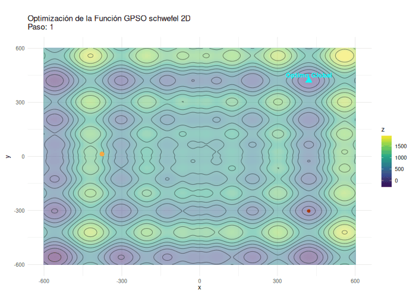

---
output:
  html_document:
    toc: false
    css: apa_style.css
    theme: united
    highlight: pygments
    df_print: paged
    number_sections: false
  pdf_document:
    toc: false
---

<!-- Portada del Trabajo -->

::: {style="text-align: center; color: black; margin-top: 60px;"}
<h1>TRABAJO 1: OPTIMIZACIÓN HEURÍSTICA</h1>

<h2>REDES NEURONALES Y ALGORITMOS BIOINSPIRADOS</h2>

<br><br><br>

<p><strong>Presentado por:</strong></p>

<p>Marcos David Carrillo Builes<br> Tomás Escobar Rivera Monsalve<br> Jose Fernando López Ramírez <br> Esteban Vásquez Pérez</p>

<br><br>

<p><strong>Profesor:</strong> Juan David Ospina Arango</p>

<p><strong>Monitor:</strong> Andrés Mauricio Zapata Rincón</p>

<br>  <br><br>

<p>Universidad Nacional de Colombia<br> Facultad de Minas<br> Ingeniería de Sistemas e Informática</p>

<p><strong>`r format(Sys.Date(), "%d de %B de %Y")`</strong></p>
:::

```{r setup, include=FALSE}
# --------------------------------------------------
# BLOQUE PRINCIPAL DE LIBRERÍAS (REEMPLAZA TODOS LOS LIBRARY() INDIVIDUALES)
# --------------------------------------------------
if (!require("pacman")) install.packages("pacman")
pacman::p_load(
  # Optimización numérica
  numDeriv,       # Gradientes/Hessianos
  GA,              # Algoritmos genéticos
  pso,             # Optimización por enjambre
  DEoptim,         # Evolución diferencial
  
  # Optimización combinatoria
  TSP,             # Problema del vendedor viajero
  acopula,         # Colonias de hormigas
  
  # Visualización
  ggplot2,         # Gráficos estáticos
  gganimate,       # Animaciones
  av,              # Exportar videos
  sf,              # Geodatos
  maps,            # Mapas base
  plotly,          # Gráficos interactivos
  
  # Datos
  dplyr            # Manipulación de datos
)

knitr::opts_chunk$set(echo = TRUE)
# --------------------------------------------------
```

#### Verificación de la carga de paquetes

```{r}
packages <- c(
  "numDeriv", "GA", "pso", "DEoptim", "TSP", "acopula",
  "ggplot2", "gganimate", "av", "sf", "maps", "plotly", "dplyr"
)

not_installed <- packages[!sapply(packages, require, character.only = TRUE)]

if (length(not_installed) == 0) {
  message("Paquetes instalados correctamente ")
} else {
  message("No se instalaron los paquetes: ", paste(not_installed, collapse = ", "))
}
```

# Parte 1: Optimización Numérica

-   Optimice las funciones en dos y tres dimensiones usando un método de descenso por gradiente con condición inicial aleatoria

-   Optimice las funciones en dos y tres dimensiones usando: algoritmos evolutivos, optimización de partículas y evolución diferencial

-   Represente con un gif animado o un video el proceso de optimización de descenso por gradiente y el proceso usando el método heurístico.

-   ¿Qué aportaron los métodos de descenso por gradiente y qué aportaron los métodos heurísticos? Para responder a esta pregunta considere el valor final de la función objetivo y el número de evaluaciones de la función objetivo. Para responder a esta pregunta es posible que se requiera hacer varias corridas de los algoritmos.


## 0. Exploración de las funciones

### Función de Schwefel

$$
f(\mathbf{x}) = 418.9829d - \sum_{i=1}^d x_i \sin(\sqrt{|x_i|})
$$


**Descripción:**

*Dimensiones:* $d$

La función de Schwefel cuenta con múltiples mínimos locales.

**Dominio:**

La función se evalúa en el hipercubo: $x_i \in [-500, 500]$, para todo $i = 1, \dots, d$.

**Mínimo Global:**

$f(\mathbf{x}^*) = 0$, en $\mathbf{x}^* = (420.9687, \dots, 420.9687)$

#### Definición de Función

```{r functions}
# Función Schwefel
schwefel <- function(x) {
  A <- 418.9829
  d <- length(x)
  z <- A*d - sum(x * sin(sqrt(abs(x))))
 
  return (z)
}
```

Sabemos que la función de Schwefel tiene un mínimo local en $x^*=(420.9687, \cdots, 420.9687)$

```{r}
schwefel(c(420.9687, 420.9687))
schwefel(c(420.9687, 420.9687, 420.9687))
```

Estos resultados representan valores aproximados a cero debido a errores de redondeo introducidos en la programación de la función.

Ahora vamos a visualizar la función:

```{r}
# Código para graficar cualquier función
plot_function <- function(func, x_range = c(-500, 500), n_points = 1000, highlight_x = NULL) {
  # Crear el vector de x en el rango especificado
  x <- seq(x_range[1], x_range[2], length.out = n_points)
 
  # Evaluar la función en los puntos de x
  y <- sapply(x, function(xi) func(c(xi)))
 
  # Graficar la función
  plot(x, y, type = "l", col = "blue", lwd = 2,
       main = paste("Gráfico de la función", deparse(substitute(func))),
       xlab = "x", ylab = paste(deparse(substitute(func)), "(x)"))
 
  # Si se especifica un valor de x para destacar, agregar la línea vertical y el punto
  if (!is.null(highlight_x)) {
    highlight_y <- func(c(highlight_x))
    abline(v = highlight_x, col = "red", lty = 2)
    points(highlight_x, highlight_y, col = "red", pch = 19)
  }
}
```

```{r fig.cap="**Fig 1.** _Evaluación de Schwefel (2D)_" , fig.align="center", out.width="70%"}
plot_function(schwefel, highlight_x = 420.9687)
```

```{r}
plot_function_3d <- function(func,
                           x_range = c(-500, 500),
                           y_range = c(-500, 500),
                           resolution = 100,
                           optimal_points = NULL,
                           colorscale = "Viridis",
                           title = "Visualización 3D de función",
                           x_label = "x",
                           y_label = "y",
                           z_label = "f(x,y)") {
 
  # Crear grid de puntos
  x <- seq(x_range[1], x_range[2], length.out = resolution)
  y <- seq(y_range[1], y_range[2], length.out = resolution)
 
  # Evaluar la función en toda la cuadrícula
  z <- outer(x, y, Vectorize(function(x, y) func(c(x, y))))
 
  # Crear el gráfico 3D interactivo
  p <- plot_ly(x = ~x, y = ~y, z = ~z) %>%
    add_surface(colorscale = colorscale)
 
  # Agregar puntos óptimos si se especifican
  if (!is.null(optimal_points)) {
    for (i in 1:nrow(optimal_points)) {
      point <- optimal_points[i, ]
      p <- p %>% add_markers(
        x = point$x,
        y = point$y,
        z = func(c(point$x, point$y)),
        marker = list(color = point$color, size = point$size),
        name = point$name
      )
    }
  }
 
  # Configurar el diseño del gráfico
  p <- p %>% layout(
    title = title,
    scene = list(
      xaxis = list(title = x_label),
      yaxis = list(title = y_label),
      zaxis = list(title = z_label)
    )
  )
 
  return(p)
}
```

```{r fig.cap="**Fig 2.** *Evaluación de Schwefel (3D)*", fig.align="center", out.width="70%", layout.align="center"}
# Definir óptimo schwefel
optimal_points <- data.frame(
  x = c(420.9687),
  y = c(420.9687),
  name = c("Óptimo global"),
  color = c("red"),
  size = c(5)
)

# Graficar la función con su óptimo
plot_function_3d(
  func = schwefel,
  x_range = c(-500, 500),
  y_range = c(-500, 500),
  resolution = 100,
  optimal_points = optimal_points,
  title = "Función de Schwefel (2D -> 3D)",
  z_label = "Schwefel(x, y)"
)
```

```{r fig.cap="**Fig 3.** _Curvas de Nivel de Schwefel_" , fig.align="center", out.width="70%"}
# Crear una grilla de puntos (para 2D)
x_vals <- seq(-500, 500, length.out = 200)
y_vals <- seq(-500, 500, length.out = 200)
grid <- expand.grid(x = x_vals, y = y_vals) %>%
  rowwise() %>%
  mutate(z = schwefel(c(x, y))) %>%
  ungroup()

# Crear gráfico de curvas de nivel
ggplot(grid, aes(x = x, y = y, z = z)) +
  geom_contour_filled(bins = 30) +  # Colores suaves
  geom_contour(color = "black", alpha = 0.3) +  # Líneas de nivel
  geom_point(aes(x = 420.9687, y = 420.9687), color = "red", size = 3) +  # Óptimo
  annotate("text", x = 420.9687, y = 420.9687 + 30, label = "Óptimo", color = "red") +
  theme_minimal() +
  scale_fill_viridis_d() +
  labs(
    title = "Curvas de nivel - Función de Schwefel",
    subtitle = "Visualización 2D de la superficie 3D",
    x = "Valor de x_1",
    y = "Valor de x_2",
    fill = "Valor de la función"
  )
```

### Función de Griewank

$$
f(\mathbf{x}) = 1 + \frac{1}{4000} \sum_{i=1}^{d} x_i^2 - \prod_{i=1}^{d} \cos\left(\frac{x_i}{\sqrt{i}}\right)
$$

**Descripción:**

*Dimensiones:* $d$

La función de Griewank tiene una estructura ondulada con múltiples mínimos locales, pero un único mínimo global en el origen.

**Dominio:**

$x_i \in [-600, 600]$, para todo $i = 1, \dots, d$

**Mínimo Global:**

$f(\mathbf{0}) = 0$, en $\mathbf{x} = (0, \dots, 0)$

### Definición de Función

```{r function Griewank}
# Función Griewank (2D y 3D)
griewank <- function(x) {
  sum_term <- sum(x^2) / 4000
  prod_term <- prod(cos(x / sqrt(seq_along(x))))
  return(1 + sum_term - prod_term)
}
```

```{r}
griewank(c(0, 0))
griewank(c(0, 0, 0))
```

Estos resultados representan el mínimo global de la función de Griewank, que es 0 en el origen.

```{r fig.cap="**Fig 5.** *Evaluación de Griewank (2D)*", fig.align="center", out.width="70%"}
plot_function(griewank, x_range = c(-600, 600), highlight_x = 0)
```

```{r fig.cap="**Fig 5.** *Evaluación de Griewank (3D)*", fig.align="center", out.width="70%"}
# Definir óptimo griewank
optimal_points <- data.frame(
  x = c(0),
  y = c(0),
  name = c("Óptimo global"),
  color = c("red"),
  size = c(5)
)

# Graficar la función con su óptimo
plot_function_3d(
  func = griewank,
  x_range = c(-600, 600),
  y_range = c(-600, 600),
  resolution = 100,
  optimal_points = optimal_points,
  title = "Función de Griewank (2D -> 3D)",
  z_label = "Griewank(x, y)"
)
```

```{r fig.cap="**Fig 6.** _Curvas de Nivel de Griewank_", fig.align="center", out.width="70%"}
# Crear una grilla de puntos (para 2D)
x_vals <- seq(-600, 600, length.out = 200)
y_vals <- seq(-600, 600, length.out = 200)
grid <- expand.grid(x = x_vals, y = y_vals) %>%
  rowwise() %>%
  mutate(z = griewank(c(x, y))) %>%
  ungroup()

# Crear gráfico de curvas de nivel
ggplot(grid, aes(x = x, y = y, z = z)) +
  geom_contour_filled(bins = 30) +  # Colores suaves
  geom_contour(color = "black", alpha = 0.3) +  # Líneas de nivel
  geom_point(aes(x = 0, y = 0), color = "red", size = 3) +  # Óptimo
  annotate("text", x = 0, y = 30, label = "Óptimo", color = "red") +
  theme_minimal() +
  scale_fill_viridis_d() +
  labs(
    title = "Curvas de nivel - Función de Griewank",
    subtitle = "Visualización 2D de la superficie 3D",
    x = "Valor de x_1",
    y = "Valor de x_2",
    fill = "Valor de la función"
  )
```

## 1. Optimización por descenso del gradiente o métodos Quasi-Newton

Como podemos ver, la función cuenta con varios óptimos locales que pueden hacer que un método numérico basado en el gradiente sea propenso a errores. Para ello vamos a ver cómo se comporta la solución del método `optim(method = "BFGS")` que es el más parecido al que vimos en clase. Este método Quasi-Newton optimiza la función utilizando una aproximación del gradiente y la matriz Hessiana, sin calcularlos directamente.

Antes de esto vamos a crear vectores para seguir las soluciones halladas.

```{r}

# Vectores para almacenar los valores intermedios de la función - Schwefel
schwefel_2d_history <- list()

# Función para llenar el camino de valores 2D - Schwefel
schwefel_with_history_2d <- function(x) {
  val <- schwefel(x)
  schwefel_2d_history <<- c(schwefel_2d_history, list(list(x = x, value = val)))  # Guarda el valor intermedio
  return(val)
}

schwefel_3d_history <- list()

# Función para llenar el camino de valores 3D - Schwefel
schwefel_with_history_3d <- function(x) {
  val <- schwefel(x)
  schwefel_3d_history <<- c(schwefel_3d_history, list(list(x = x, value = val)))  # Guarda el valor intermedio
  return(val)
}
  
# Vectores para almacenar los valores intermedios de la función - Griewank
griewank_2d_history <- list()

# Función para llenar el camino de valores 2D - Schwefel
griewank_with_history_2d <- function(x) {
  val <- griewank(x)
  griewank_2d_history <<- c(griewank_2d_history, list(list(x = x, value = val)))  # Guarda el valor intermedio
  return(val)
}

griewank_3d_history <- list()

# Función para llenar el camino de valores 3D - Schwefel
griewank_with_history_3d <- function(x) {
  val <- griewank(x)
  griewank_3d_history <<- c(griewank_3d_history, list(list(x = x, value = val)))  # Guarda el valor intermedio
  return(val)
  
}
```

```{r}
# Optimización 2D

set.seed(1987)

x0_2d <- runif(1, min=-500, max=500)
x0_2d_g <- runif(1,min=-600,max=600)

# Optimización
res_2d <- optim(
  par = x0_2d,
  fn = schwefel_with_history_2d,
  method = "BFGS",
  control = list(trace = 1, REPORT = 1, maxit = 500),
  hessian = FALSE  # En 2d no usamos el Hessiano sino el gradiente únicamente
)

# Optimización Griewank
res_2d_g <- optim(
  par = x0_2d_g,
  fn = griewank_with_history_2d,
  method = "BFGS",
  control = list(trace = 1, REPORT = 1, maxit = 500),
  hessian = FALSE  # En 2d no usamos el Hessiano sino el gradiente únicamente
)

print('Schwefel')
# Resultado
res_2d$par       # Coordenadas del mínimo encontrado
res_2d$value     # Valor mínimo de la función

print('Griewank')
res_2d_g$par
res_2d_g$value

```

```{r}
# Optimización 3D

set.seed(1987)

x0_3d <- runif(2, min=-500, max=500)
x0_3d_g <- runif(2, min=-600, max=600)


# Optimización
res_3d <- optim(
  par = x0_3d,
  fn = schwefel_with_history_3d,
  method = "BFGS",
  control = list(trace = 1, REPORT = 1, maxit = 1000),
)

res_3d_g <- optim(
  par = x0_3d_g,
  fn = griewank_with_history_3d,
  method = "BFGS",
  control = list(trace = 1, REPORT = 1, maxit = 1000),
)

# Resultado
res_3d$par       # Coordenadas del mínimo encontrado
res_3d$value     # Valor mínimo de la función

res_3d_g$par
res_3d_g$value
```

### 2. Métodos Heurísticos

Nos enfocaremos en tres poderosos métodos heurísticos inspirados en la naturaleza:

Algoritmos Evolutivos (GA), que emulan el proceso de selección natural para encontrar soluciones óptimas.

Optimización por Enjambre de Partículas (PSO), basada en el comportamiento colectivo de animales como aves o peces.

Estrategias de Evolución Diferencial (DE), un método robusto de optimización global que combina mutación, cruce y selección.

#### 2.1 Algoritmo Genético (GA)

```{r Algoritmo Genético}
# Función que aplica un Algoritmo Genético (GA) para optimizar una función de prueba
# y guarda el historial de las mejores soluciones en cada iteración.

genetic_optimizer_with_history <- function(func, lower, upper, dim, popSize, maxiter) {
  # Lista para almacenar el historial de la mejor solución en cada iteración
  history <- list()

  # Función monitor que se ejecuta en cada iteración del GA
  # Guarda el mejor individuo de la población y su evaluación con la función objetivo
  monitor <- function(obj) {
    # Extraer el mejor individuo de la población actual (mayor fitness)
    best <- obj@population[which.max(obj@fitness), ]
    
    # Evaluar la función objetivo con ese individuo
    val <- func(best)
    
    # Guardar la solución y su valor en el historial, indexado por el número de iteración
    history[[obj@iter]] <<- list(x = best, value = val)
  }

  # Ejecutar el Algoritmo Genético
  result <- ga(
    type = "real-valued",                     
    fitness = function(x) -func(x),           
    lower = rep(lower, dim),                  
    upper = rep(upper, dim),                  
    popSize = popSize,                        
    maxiter = maxiter,                        
    monitor = monitor                         
  )

  return(list(result = result, history = history))
}
```

Creamos una tabla para ver los resultados con varios valores posibles y comparar las soluciones para así elegir los mejores parámetros. De una vez la generalizamos para los otros métodos.

```{r tabla_ga}
optimizer_test <- function(method, func, func_name, dim, lower, upper) {
  # Definir parámetros por método
  params_list <- switch(method,
    "GA" = list(
      popSize = c(30, 50, 100),
      maxiter = c(50, 100, 200)
    ),
    "PSO" = list(
      s = c(20, 40, 60),
      maxit = c(50, 100, 200)
    ),
    "DE" = list(
      NP = c(30, 50, 70),
      itermax = c(50, 100, 200)
    )
  )
  
  # Crear combinaciones de parámetros
  param_combinations <- expand.grid(params_list)
  
  # Función para ejecutar cada combinación
  run_combination <- function(params) {
    start_time <- Sys.time()
    
    result <- switch(method,
      "GA" = genetic_optimizer_with_history(
        func = func,
        lower = lower,
        upper = upper,
        dim = dim,
        popSize = params[[1]],
        maxiter = params[[2]]
      ),
      "PSO" = pso_optimizer_with_history(
        func = func,
        lower = lower,
        upper = upper,
        dim = dim,
        maxit = params[[2]],
        s = params[[1]]
      ),
      "DE" = de_optimizer_with_history(
        func = func,
        lower = lower,
        upper = upper,
        dim = dim,
        NP = params[[1]],
        itermax = params[[2]]
      )
    )
    
    # Extraer resultados comunes
    best_value <- switch(method,
      "GA" = -result$result@fitnessValue,
      "PSO" = result$result$value,
      "DE" = result$result$optim$bestval
    )
    
    convergence_iter <- switch(method,
      "GA" = result$result@iter,
      "PSO" = which.min(sapply(result$history, function(x) x$value)),
      "DE" = result$result$optim$iter
    )
    
    elapsed <- as.numeric(Sys.time() - start_time)
    
    # Nombre de parámetros específicos por método
    param_names <- switch(method,
      "GA" = c("Población", "Iteraciones"),
      "PSO" = c("Enjambre", "Iteraciones"),
      "DE" = c("Población", "Iteraciones")
    )
    
    return(c(
      best_value = best_value,
      convergence_iter = convergence_iter,
      param1 = params[[1]],
      param2 = params[[2]],
      time = elapsed
    ))
  }
  
  # Ejecutar todas las combinaciones
  results <- apply(param_combinations, 1, run_combination)
  
  # Convertir a data.frame
  results_df <- as.data.frame(t(results))
  
  # Nombrar columnas según método
  colnames(results_df) <- c("Mejor Valor", "Iter Convergencia",
                           switch(method,
                             "GA" = c("Tamaño Población", "Máx Iteraciones"),
                             "PSO" = c("Tamaño Enjambre", "Máx Iteraciones"),
                             "DE" = c("Tamaño Población", "Máx Iteraciones")
                           ),
                           "Tiempo (s)")
  
  # Ordenar por mejor valor
  results_df <- results_df[order(results_df$"Mejor Valor"), ]
  
  # Mostrar tabla 
  knitr::kable(results_df, digits = 4, 
               caption = paste("Resultados GA para", func_name, dim, "D"),
               format = "html") %>%
    kableExtra::kable_styling(bootstrap_options = c("striped", "hover"),
                              full_width = FALSE) %>%
    kableExtra::column_spec(1:ncol(results_df), width = "2cm") %>%
    kableExtra::row_spec(0, bold = TRUE, color = "white", background = "#3498db")
}
```

##### Schwefel 2D
```{r}
optimizer_test("GA", schwefel, "Schwefel", 2, -500, 500)
```

Elegimos el mejor resultado que obtenemos y llamamos a la función para guardar su historial y poder graficarlo después.

```{r ga_schwefel 2D}
ga_schwefel_2d <- genetic_optimizer_with_history(schwefel, -500, 500, dim = 2, popSize = 30, maxiter = 200)
```

##### Schwefel 3D
```{r}
optimizer_test("GA", schwefel, "Schwefel", 3, -500, 500)
```

```{r ga_schwefel 3D}
ga_schwefel_3d <- genetic_optimizer_with_history(schwefel, -500, 500, dim = 3, popSize = 30, maxiter = 200)
```

##### Griewank 2D
```{r}
optimizer_test("GA", griewank, "Griewank", 2, -500, 500)
```

```{r ga_griewank 2D}
ga_griewank_2d <- genetic_optimizer_with_history(griewank, -600, 600, dim = 2, popSize = 100, maxiter = 100)
```

##### Griewank 3D
```{r}
optimizer_test("GA", griewank, "Griewank", 3, -500, 500)
```

```{r ga_griewank 3D}
ga_griewank_3d <- genetic_optimizer_with_history(griewank, -600, 600, dim = 3, popSize = 100, maxiter = 100)
```

#### 2.2 Optimización por Enjambre (PSO)

```{r Optimización por Enjambre}
# Función que aplica el algoritmo de Optimización por Enjambre de Partículas (PSO)
# para minimizar una función objetivo y guarda el historial de puntos evaluados.

pso_optimizer_with_history <- function(func, lower, upper, dim, maxit, s) {
  # Lista para guardar el historial de evaluaciones
  history <- list()

  # Se define una función "envoltura" que intercepta las evaluaciones de la función objetivo
  # y guarda cada punto (posición del enjambre) con su valor correspondiente.
  wrapped_func <- function(x) {
    val <- func(x)  # Evaluar la función en x
    history[[length(history) + 1]] <<- list(x = x, value = val)  # Guardar evaluación
    return(val)  # Devolver el valor calculado (PSO minimiza este valor)
  }

  # Ejecutar el algoritmo de PSO:
  result <- psoptim(
    par = runif(dim, lower, upper),         
    fn = wrapped_func,                      
    lower = rep(lower, dim),                
    upper = rep(upper, dim),                
    control = list(maxit = maxit, s = s)    
  )

  return(list(result = result, history = history))
}
```

##### Schwefel 2D
```{r}
optimizer_test("PSO", schwefel, "Schwefel", 2, -500, 500)
```

```{r pso_schwefel 2D}
pso_schwefel_2d <- pso_optimizer_with_history(schwefel, -500, 500, dim = 3, maxit = 200, s = 20)
```

##### Schwefel 3D
```{r}
optimizer_test("PSO", schwefel, "Schwefel", 3, -500, 500)
```

```{r pso_schwefel 3D}
pso_schwefel_3d <- pso_optimizer_with_history(schwefel, -500, 500, dim = 3, maxit = 200, s = 40)
```

##### Griewank 2D
```{r}
optimizer_test("PSO", griewank, "Griewank", 2, -600, 600)
```

```{r pso_griewank 2D}
pso_griewank_2d <- pso_optimizer_with_history(griewank, -600, 600, dim = 2, maxit = 200, s = 40)
```

##### Griewank 3D
```{r}
optimizer_test("PSO", griewank, "Griewank", 3, -600, 600)
```

```{r pso_griewank 3D}
pso_griewank_3d <- pso_optimizer_with_history(griewank, -600, 600, dim = 2, maxit = 200, s = 60)
```

#### 2.3 Evolución Diferencial (DE)

```{r Evolución Diferencial}
# Función que aplica el algoritmo de Evolución Diferencial (DE)
# para minimizar una función objetivo y guarda el historial de soluciones.

de_optimizer_with_history <- function(func, lower, upper, dim, NP = 50, itermax = 100) {
  # Crea vectores de límites inferiores y superiores replicados por cada dimensión
  lower_vec <- rep(lower, dim)
  upper_vec <- rep(upper, dim)

  # Ejecuta el algoritmo DE usando la función DEoptim
  result <- DEoptim(
    fn = func,                    
    lower = lower_vec,            
    upper = upper_vec,            
    control = DEoptim.control(
      NP = NP,                    
      itermax = itermax,         
      storepopfrom = 1,          
      trace = FALSE              
    )
  )

  # Extraer el historial de las mejores soluciones por iteración desde result$member$bestmemit
  pops <- result$member$bestmemit  # Matriz con la mejor solución por iteración (columnas = pasos)
  history <- vector("list", ncol(pops))  # Inicializar lista de historial

  # Recorrer las columnas (iteraciones) y guardar cada punto con su evaluación
  for (i in seq_len(ncol(pops))) {
    x <- pops[, i]             # Solución en la iteración i
    val <- func(x)             # Evaluar función en ese punto
    history[[i]] <- list(x = x, value = val)  # Guardar en historial
  }

  return(list(result = result, history = history))
}
```

##### Schwefel 2D
```{r}
optimizer_test("DE", schwefel, "Schwefel", 2, -500, 500)
```

```{r de_schwefel_2D}
de_schwefel_2d <- de_optimizer_with_history(schwefel, -500, 500, dim = 2, NP = 30, itermax = 200)
```

##### Schwefel 3D
```{r}
optimizer_test("DE", schwefel, "Schwefel", 3, -500, 500)
```

```{r de_schwefel 3D}
de_schwefel_3d <- de_optimizer_with_history(schwefel, -500, 500, dim = 3, NP = 30, itermax = 200)
```

##### Griewank 2D
```{r}
optimizer_test("DE", griewank, "Griewank", 2, -600, 600)
```

```{r de_griewank 2D}
de_griewank_2d <- de_optimizer_with_history(griewank, -600, 600, dim = 2, NP = 70, itermax = 200)
```

##### Griewank 3D
```{r}
optimizer_test("DE", griewank, "Griewank", 2, -600, 600)
```

```{r de_griewank 3D}
de_griewank_3d <- de_optimizer_with_history(griewank, -600, 600, dim = 3, NP = 30, itermax = 200)
```

## 3. Visualización de Resultados

### 3.1 Animación del Descenso de Gradiente

Para crear la animación debemos generar múltiples imágenes usando el historial de soluciones evaluadas en la función objetivo.

#### Schwefel

```{r}
# Base de la curva de la función schwefel
x_vals <- seq(-500, 500, length.out = 1000)
curve_df_2d <- data.frame(x = x_vals, value = sapply(x_vals, function(xi) schwefel(c(xi))))

# Extraer historia del optimizador
schwefel_df_2d <- data.frame(
  step = 1:length(schwefel_2d_history),
  x = sapply(schwefel_2d_history, function(p) p$x),
  value = sapply(schwefel_2d_history, function(p) p$value)
)
```

**Camino de la solución en Schwefel 2D**

```{r eval=FALSE}
p <- ggplot() +
  geom_line(data = curve_df_2d, aes(x = x, y = value), color = "blue", linewidth = 1.2) +
  geom_point(data = schwefel_df_2d, aes(x = x, y = value), color = "red", size = 2) +
  transition_reveal(along = step) +
  labs(title = "Paso del optimizador: {frame_along}", x = "x", y = "Schwefel(x)") +
  theme_minimal()

animate(p, fps = 4, width = 600, height = 400, renderer = gifski_renderer("files/schwefel_path.gif"))
```

```{r fig.cap="**Fig 6.** *Camino de la solución en Schwefel 2D*", fig.align="center", out.width="70%"}
knitr::include_graphics("files/schwefel_path.gif")
```

Como podemos notar, los algoritmos numéricos dependen altamente de la elección del punto inicial $x_0^*$. En el GIF se ve además que la solución se desplaza por fuera de la gráfica, esto se debe a que el optimizador podría estar explorando soluciones que se mueven en $c(x1)$, pero al graficar los frames se pueden ver puntos intermedios en la solución. Sin embargo finalmente se vuelve a la gráfica cuando se está estabilizando el óptimo.

**Camino de la solución en Schwefel 3D con curvas de nivel**

```{r}
x_vals <- seq(-500, 500, length.out = 200)
y_vals <- seq(-500, 500, length.out = 200)
grid <- expand.grid(x = x_vals, y = y_vals) %>%
  rowwise() %>%
  mutate(z = schwefel(c(x, y))) %>%
  ungroup()

schwefel_df_3d <- data.frame(
  step = 1:length(schwefel_3d_history),
  x = sapply(schwefel_3d_history, function(p) p$x[1]),
  y = sapply(schwefel_3d_history, function(p) p$x[2]),
  z = sapply(schwefel_3d_history, function(p) p$value)
)
```

```{r eval=FALSE}
p <- ggplot() +
  # Capa BASE de relleno
  geom_raster(data = grid, aes(x = x, y = y, fill = z), alpha = 0.5) +
  scale_fill_viridis_c(option = "viridis", name = "Valor Schwefel") +
  
  # Curvas de nivel
  geom_contour(data = grid, aes(x = x, y = y, z = z), 
               color = "black", alpha = 0.4, bins = 15) +
  
  # Trayectoria del optimizador
  geom_path(data = schwefel_df_3d, aes(x = x, y = y), 
            color = "darkgrey", alpha = 0.5, linewidth = 0.8) +
  
  # Puntos animados (nuevo esquema de colores)
  geom_point(data = schwefel_df_3d, aes(x = x, y = y, color = step), 
             size = 3, show.legend = FALSE) +
  scale_color_gradient(low = "orange", high = "red") +  # Azul a verde
  
  # Punto óptimo
  geom_point(aes(x = 420.9687, y = 420.9687), 
             shape = 17, color = "cyan", size = 4) +
  annotate("text", x = 420.9687, y = 450, label = "Óptimo Global", 
           color = "cyan", fontface = "bold") +
  
  # Estilo y animación
  theme_minimal() +
  labs(
    title = "Optimización de la Función Schwefel\nPaso: {frame_time}",
    x = "Coordenada x₁",
    y = "Coordenada x₂"
  ) +
  transition_time(step) +
  shadow_wake(wake_length = 0.1, alpha = 0.3) +
  theme(plot.margin = margin(t = 30, r = 10, b = 10, l = 10, unit = "pt"))

# Renderizar la animación
animate(p, fps = 7, width = 800, height = 600, renderer = gifski_renderer("files/schwefel_3d_path.gif"))
```

```{r fig.cap="**Fig 7.** *Camino de la solución en Schwefel 3D*", fig.align="center", out.width="70%"}
knitr::include_graphics("files/schwefel_3d_path.gif")
```

#### Griewank


```{r}
# Base de la curva de la función Griewank
x_vals <- seq(-600, 600, length.out = 1000)
curve_df_2d_g <- data.frame(x = x_vals, value = sapply(x_vals, function(xi) griewank(c(xi))))

# Extraer historia del optimizador
griewank_df_2d <- data.frame(
  step = 1:length(griewank_2d_history),
  x = sapply(griewank_2d_history, function(p) p$x),
  value = sapply(griewank_2d_history, function(p) p$value)
)
```

**Camino de la solución en Griewank 2D**

```{r eval=FALSE}
p <- ggplot() +
  geom_line(data = curve_df_2d_g, aes(x = x, y = value), color = "blue", linewidth = 1.2) +
  geom_point(data = griewank_df_2d, aes(x = x, y = value), color = "red", size = 2) +
  transition_reveal(along = step) +
  labs(title = "Paso del optimizador: {frame_along}", x = "x", y = "Griewank(x)") +
  theme_minimal()

animate(p, fps = 4, width = 600, height = 400, renderer = gifski_renderer("files/griewank_path.gif"))
```

```{r fig.cap="**Fig 8.** *Camino de la solución en Griewank 2D*", fig.align="center", out.width="70%"}
knitr::include_graphics("files/griewank_path.gif")
```

**Camino de la solución en Griewank 3D con curvas de nivel**

```{r}

x_vals <- seq(-600, 600, length.out = 200)
y_vals <- seq(-600, 600, length.out = 200)
grid <- expand.grid(x = x_vals, y = y_vals) %>%
  rowwise() %>%
  mutate(z = griewank(c(x, y))) %>%
  ungroup()

griewank_df_3d <- data.frame(
  step = 1:length(griewank_3d_history),
  x = sapply(griewank_3d_history, function(p) p$x[1]),
  y = sapply(griewank_3d_history, function(p) p$x[2]),
  z = sapply(griewank_3d_history, function(p) p$value)
  )
```

```{r eval=FALSE}
p <- ggplot() +
  # Capa BASE de relleno
  geom_raster(data = grid, aes(x = x, y = y, fill = z), alpha = 0.5) +
  scale_fill_viridis_c(option = "viridis", name = "Valor Griewank") +
  
  # Curvas de nivel
  geom_contour(data = grid, aes(x = x, y = y, z = z), 
               color = "black", alpha = 0.4, bins = 15) +
  
  # Trayectoria del optimizador
  geom_path(data = griewank_df_3d, aes(x = x, y = y), 
            color = "darkgrey", alpha = 0.5, linewidth = 0.8) +
  
  # Puntos animados (nuevo esquema de colores)
  geom_point(data = griewank_df_3d, aes(x = x, y = y, color = step), 
             size = 3, show.legend = FALSE) +
  scale_color_gradient(low = "orange", high = "red") +  # Azul a verde
  
  # Punto óptimo
  geom_point(aes(x = 0, y = 0), 
             shape = 17, color = "cyan", size = 4) +
  annotate("text", x = 0, y = 450, label = "Óptimo Global", 
           color = "cyan", fontface = "bold") +
  
  # Estilo y animación
  theme_minimal() +
  labs(
    title = "Optimización de la Función Griewank\nPaso: {frame_time}",
    x = "Coordenada x₁",
    y = "Coordenada x₂"
  ) +
  transition_time(step) +
  shadow_wake(wake_length = 0.1, alpha = 0.3) +
  theme(plot.margin = margin(t = 30, r = 10, b = 10, l = 10, unit = "pt"))

# Renderizar la animación
animate(p, fps = 7, width = 800, height = 600, renderer = gifski_renderer("files/griewank_3d_path.gif"))
```

```{r fig.cap="**Fig 9.** *Camino de la solución en Griewank 3D*", fig.align="center", out.width="70%"}
knitr::include_graphics("files/griewank_3d_path.gif")
```

### 3.2 Animación de Métodos Heurísticos

```{r animación métodos heurísticos}
# Convertir historial en data.frame
convert_history_to_df <- function(history) {
  df <- data.frame(
    step = seq_along(history),
    x = sapply(history, function(p) p$x[1]),
    y = sapply(history, function(p) p$x[2]),
    value = sapply(history, function(p) p$value)
  )
  return(df)
}

# Base para curvas de nivel
create_grid <- function(func, lower, upper, n = 200) {
  x_vals <- seq(lower, upper, length.out = n)
  y_vals <- seq(lower, upper, length.out = n)
  grid <- expand.grid(x = x_vals, y = y_vals)
  grid$z <- apply(grid, 1, function(row) func(c(row[1], row[2])))
  return(grid)
}

# Crear y guardar animación
plot_trajectory_animation <- function(history_df, grid_df, func, title, output_file) {
  # Determinar punto óptimo según la función
  opt_point <- if (identical(func, schwefel)) {
    c(420.9687, 420.9687)
  } else if (identical(func, griewank)) {
    c(0, 0)
  } else {
    c(NA_real_, NA_real_)
  }

  # Posición del texto
  optimal_label_y <- ifelse(!is.na(opt_point[2]) && opt_point[2] > 0,
                            opt_point[2] + 30,
                            opt_point[2] + 3)

  # Crear el gráfico
  p <- ggplot() +
    geom_raster(data = grid_df, aes(x = x, y = y, fill = z), alpha = 0.5) +
    scale_fill_viridis_c() +
    geom_contour(data = grid_df, aes(x = x, y = y, z = z), color = "black", alpha = 0.4) +
    geom_path(data = history_df, aes(x = x, y = y), color = "darkgrey", alpha = 0.5) +
    geom_point(data = history_df, aes(x = x, y = y, color = step), size = 3, show.legend = FALSE) +
    scale_color_gradient(low = "orange", high = "red") +
    theme_minimal() +
    labs(title = paste0("Optimizacion de la Funcion ", title),
         x = "x", y = "y") +
    theme(plot.margin = margin(t = 40, r = 10, b = 10, l = 10, unit = "pt")) +
    transition_time(step) +
    shadow_wake(wake_length = 0.1, alpha = 0.3)

  # Añadir punto óptimo si es válido
  if (!any(is.na(opt_point))) {
    p <- p +
      geom_point(aes(x = opt_point[1], y = opt_point[2]), shape = 17, color = "cyan", size = 4) +
      annotate("text", x = opt_point[1], y = optimal_label_y, label = "Óptimo Global", 
               color = "cyan", fontface = "bold")
  }

  # Animar
  animate(p, fps = 6, width = 700, height = 500, renderer = gifski_renderer(output_file))
}
```

```{r, eval=FALSE}
# GA Schwefel 2D
history_df <- convert_history_to_df(ga_schwefel_2d$history)
grid_df <- create_grid(schwefel, -600, 600)
plot_trajectory_animation(history_df, grid_df, schwefel, "GA schwefel 2D", "files/ga_schwefel_2d.gif")
```

```{r fig.cap="**Fig 10.** *GA Schwefel 2D*", fig.align="center", out.width="70%"}
knitr::include_graphics("files/ga_schwefel_2d.gif")
```

```{r, eval=FALSE}
# GA Schwefel 3D
history_df <- convert_history_to_df(ga_schwefel_3d$history)
grid_df <- create_grid(schwefel, -600, 600)
plot_trajectory_animation(history_df, grid_df, schwefel, "GA schwefel 3D", "files/ga_schwefel_3d.gif")
```

```{r fig.cap="**Fig 11.** *GA Schwefel 3D*", fig.align="center", out.width="70%"}

```


```{r, eval=FALSE}
# GA Griewank 2D
history_df <- convert_history_to_df(ga_griewank_2d$history)
grid_df <- create_grid(griewank, -600, 600)
plot_trajectory_animation(history_df, grid_df, griewank, "GA Griewank 2D", "files/ga_griewank_2d.gif")
```

```{r fig.cap="**Fig 12.** *GA Griewank 2D*", fig.align="center", out.width="70%"}
knitr::include_graphics("files/ga_griewank_2d.gif")
```

```{r, eval=FALSE}
# GA Griewank 3D
history_df <- convert_history_to_df(ga_griewank_3d$history)
grid_df <- create_grid(griewank, -600, 600)
plot_trajectory_animation(history_df, grid_df, griewank, "GA Griewank 3D", "files/ga_griewank_3d.gif")
```

```{r fig.cap="**Fig 13.** *GA Griewank 3D*", fig.align="center", out.width="70%"}
knitr::include_graphics("files/ga_griewank_3d.gif")
```

```{r, eval=FALSE}
# PSO Schwefel 2D
history_df <- convert_history_to_df(pso_schwefel_2d$history)
grid_df <- create_grid(schwefel, -600, 600)
plot_trajectory_animation(history_df, grid_df, schwefel, "GPSO schwefel 2D", "files/pso_schwefel_2d.gif")
```

```{r fig.cap="**Fig 14.** *PSO Schwefel 2D*", fig.align="center", out.width="70%"}

```

```{r, eval=FALSE}
# PSO Schwefel 3D
history_df <- convert_history_to_df(pso_schwefel_3d$history)
grid_df <- create_grid(schwefel, -600, 600)
plot_trajectory_animation(history_df, grid_df, schwefel, "GPSO schwefel 3D", "files/pso_schwefel_3d.gif")
```

```{r fig.cap="**Fig 15.** *PSO Schwefel 3D*", fig.align="center", out.width="70%"}

```

```{r, eval=FALSE}
# PSO Griewank 2D
history_df <- convert_history_to_df(pso_griewank_2d$history)
grid_df <- create_grid(griewank, -600, 600)
plot_trajectory_animation(history_df, grid_df, griewank, "PSO Griewank 2D", "files/pso_griewank_2d.gif")
```

```{r fig.cap="**Fig 16.** *PSO Griewank 2D*", fig.align="center", out.width="70%"}
knitr::include_graphics("files/pso_griewank_2d.gif")
```

```{r, eval=FALSE}
# PSO Griewank 3D
history_df <- convert_history_to_df(pso_griewank_3d$history)
grid_df <- create_grid(griewank, -600, 600)
plot_trajectory_animation(history_df, grid_df, griewank, "PSO Griewank 3D", "files/pso_griewank_3d.gif")
```

```{r fig.cap="**Fig 17.** *PSO Griewank 3D*", fig.align="center", out.width="70%"}

```

```{r, eval=FALSE}
# DE Schwefel 2D
history_df <- convert_history_to_df(de_schwefel_2d$history)
grid_df <- create_grid(schwefel, -500, 500)
plot_trajectory_animation(history_df, grid_df, schwefel, "DE Schwefel 2D", "files/de_schwefel_2d.gif")
```

```{r fig.cap="**Fig 18.** *DE Schwefel 2D*", fig.align="center", out.width="70%"}
knitr::include_graphics("files/de_schwefel_2d.gif")
```

```{r, eval=FALSE}
# DE Schwefel 3D
history_df <- convert_history_to_df(de_schwefel_3d$history)
grid_df <- create_grid(schwefel, -500, 500)
plot_trajectory_animation(history_df, grid_df, schwefel, "DE Schwefel 3D", "files/de_schwefel_3d.gif")
```

```{r fig.cap="**Fig 19.** *DE Schwefel 3D*", fig.align="center", out.width="70%"}
knitr::include_graphics("files/de_schwefel_3d.gif")
```

```{r, eval=FALSE}
# DE Griewank 2D
history_df <- convert_history_to_df(de_griewank_2d$history)
grid_df <- create_grid(griewank, -600, 600)
plot_trajectory_animation(history_df, grid_df, griewank, "DE Griewank 2D", "files/de_griewank_2d.gif")
```

```{r fig.cap="**Fig 20.** *DE Griewank 2D*", fig.align="center", out.width="70%"}

```

```{r, eval=FALSE}
# DE Griewank 3D
history_df <- convert_history_to_df(de_griewank_3d$history)
grid_df <- create_grid(griewank, -600, 600)
plot_trajectory_animation(history_df, grid_df, griewank, "DE Griewank 3D", "files/de_griewank_3d.gif")
```

```{r fig.cap="**Fig 21.** *DE Griewank 3D*", fig.align="center", out.width="70%"}

```

## 4. Conclusiones

```{r conclusions, eval=FALSE}
# DISCUTIR:
# 1. Ventajas/desventajas de cada método
# 2. Sensibilidad a parámetros
# 3. Recomendaciones para cada función
```

# Parte 2: Optimización Combinatoria

Un vendedor debe hacer un recorrido por todas y cada de las 13 ciudades principales de Colombia.

Utilice colonias de hormigas y algoritmos genéticos para encontrar el orden óptimo. El costo de desplazamiento entre ciudades es la suma del valor de la hora del vendedor (es un parámetro que debe estudiarse), el costo de los peajes y el costo del combustible. Cada equipo debe definir en qué carro hace el recorrido el vendedor y de allí extraer el costo del combustible.

Adicionalmente represente con un gif animado o un video cómo se comporta la mejor solución usando un gráfico del recorrido en el mapa de Colombia.


## Reporte de Contribución Individual

-   Marcos David Carrillo Builes
-   Tomás Escobar Rivera Monsalve
-   Jose Fernando López Ramírez
-   Esteban Vásquez Pérez

## Repositorio en Github

-   [Github](https://github.com/vasquez-esteban/RNA_G4_optimizacion_heuristica)

## Bibliografía
